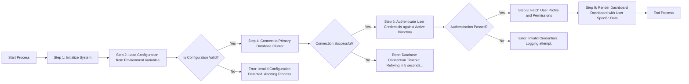
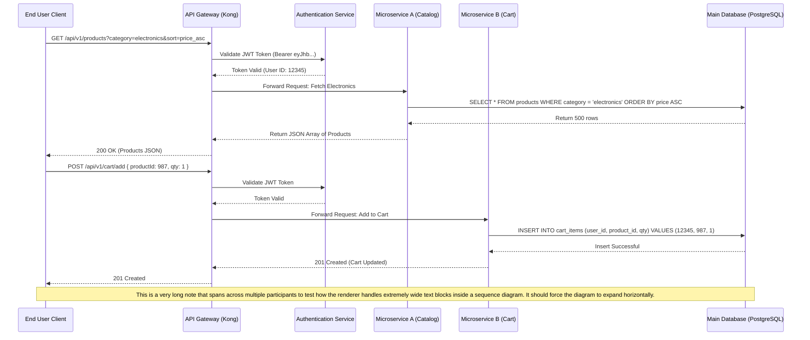
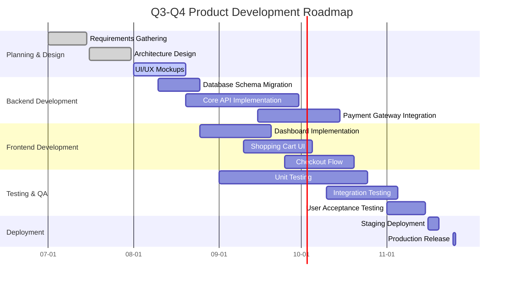
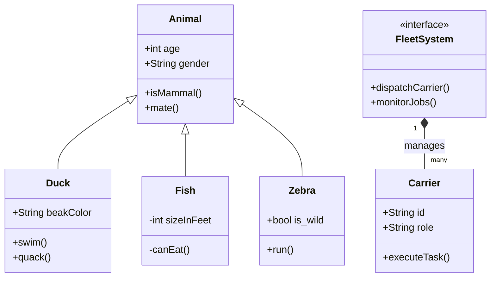

# Mermaid Rendering Test Suite

이 문서는 새로 구현된 Mermaid 다이어그램의 가로/세로 스크롤 및 클릭 시 확대(Modal) 기능을 테스트하기 위해 작성되었습니다. 다양한 크기와 복잡도를 가진 다이어그램이 포함되어 있습니다.

## 1. Extremely Wide Flowchart (가로 스크롤/확대 테스트)
매우 넓게 퍼지는 형태의 플로우차트입니다. 화면 폭을 넘어가면 스크롤이 생기거나 축소되어야 하며, 클릭 시 원본 크기로 볼 수 있어야 합니다.

## 2. Complex Sequence Diagram (세로/가로 스크롤 테스트)
참여자가 많고 메시지 길이가 길어 다이어그램이 커지는 시퀀스 다이어그램입니다.

## 3. Large Gantt Chart (복잡도 테스트)
다수의 항목이 포함된 간트 차트입니다.

## 4. Class Diagram (관계 복잡도 테스트)
클래스 간의 복잡한 관계를 나타내는 다이어그램입니다.

