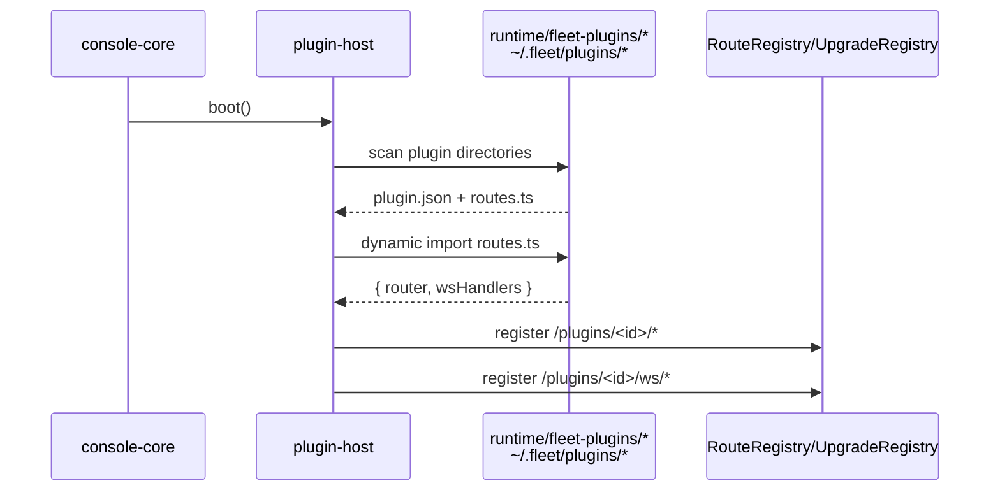
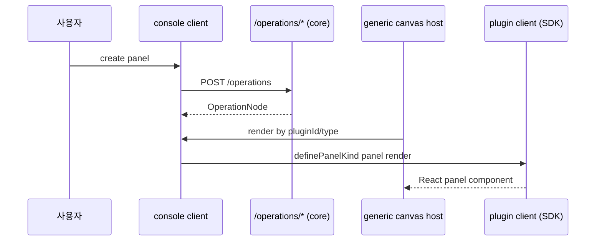
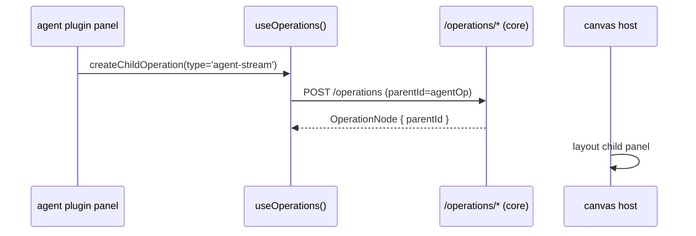
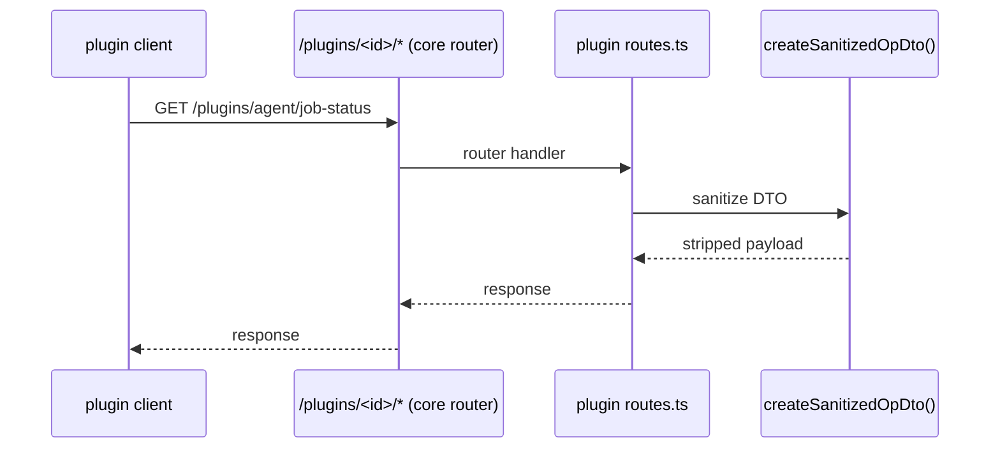
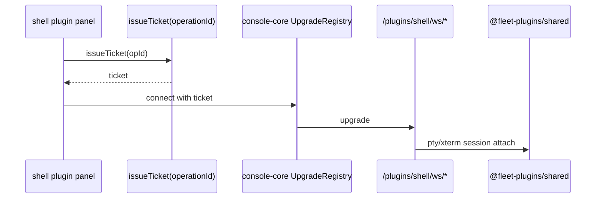

> **상태**: `planned / in-progress`  
> 이 문서는 **2026-06-21 현재 canary 기준으로 코드에 미구현된 확정 목표 아키텍처**를 기록한 결정/설계 기록(decision/design record)입니다. Nimitz 2-backend 합의(taskforce:`4cf248a3`)와 대원수 결재로 구조가 LOCKED 되었으며, 구현 완료 후 코드 상태와 재정합할 예정입니다. 현재 코드를 "이미 그렇다"고 단정하지 마세요.

## 개요

Fleet Console의 패널 기능을 플러그인 플랫폼으로 전환하는 확정 아키텍처입니다. 핵심은 다음 세 가지입니다.

1. **패널을 `operations` 리소스로 일반화** — terminal, shell, agent, custom 등 모든 패널을 단일 `OperationNode` 트리로 수렴시킵니다.
2. **built-in 패널을 동적 로드 플러그인으로 분리** — `agent`/`shell`을 `runtime/fleet-plugins/{agent,shell}`로 옮기고, console-core는 plugin-host 역할만 남깁니다.
3. **public SDK + router SDK 제공** — `runtime/fleet-console/sdk/{client,server}`를 경계로 플러그인 작성자에게 안정적인 API를 노출합니다.

## 1. 변경되는 fleet-harness 구조

### After: 6계층 트리

```text
runtime/fleet-console/src/**
  └── console-core
      ├── operations 수명주기
      ├── Theater 관리
      ├── Settings 호스트
      ├── plugin-host (디스커버리·라우터 등록)
      └── static console 서빙

runtime/fleet-console/sdk/{client,server}
  └── public SDK (별도 npm 아님, path alias @fleet-console/sdk/*)

runtime/fleet-plugins/shared
  └── 공통 pty/xterm primitives (plugin.json 없음, built-in 전용 제3범주)

runtime/fleet-plugins/{agent,shell}
  └── built-in 플러그인
      ├── plugin.json
      ├── routes.ts
      ├── api/
      └── client/

~/.fleet/plugins/**
  └── 서드파티 플러그인 (built-in과 동일한 구조)
```

### Before/After 대비

| 구분 | 현재 (평면 monolith) | 목표 (6계층) |
|------|----------------------|--------------|
| 패널 의미 | terminal / observer / shell 등 도메인별 분산 | `OperationNode` 트리로 통합 |
| 라우팅 | `server.ts` 정적 path-switch | host-owned `RouteRegistry` + 플러그인 등록 |
| built-in 위치 | `runtime/fleet-console/src/**` 난잡하게 혼재 | `runtime/fleet-plugins/{agent,shell}` |
| 공통 xterm/pty | `runtime/fleet-console` 낸 | `runtime/fleet-plugins/shared` 제3범주 |
| 외부 확장 | 없음 | `~/.fleet/plugins/**` 동적 로드 |

## 2. 일반화된 operations 리소스의 API 및 데이터 모델

### OperationNode 데이터 모델

모든 패널은 하나의 `OperationNode`로 표현됩니다.

```ts
interface OperationNode {
  id: string;
  theaterId: string;
  parentId: string | null;
  type: string;            // 'terminal' | 'shell' | 'agent' | 'custom' 등
  pluginId: string;
  title: string;
  renamedTitle?: string;
  payload: unknown;        // type별 plugin schema, 서버는 opaque 저장
  geometry?: PanelGeometry; // z-index, minimized 등은 클라이언트 저장소
  state: OperationState;
  ts: number;
}
```

- **트리**: `parentId`로 2뎁스 트리를 구성. 초기 `depth=2` 제한.
- **payload**: plugin이 선언한 schema대로 직렬화/역직렬화. console-core는 내용을 해석하지 않음.
- **geometry/z/minimized**: 브라우저 `localStorage`/`sessionStorage`에 둠. 서버 durable은 트리/상태만 저장.

### `/operations/*` API

console-core가 단독 소유합니다.

| 엔드포인트 | 설명 |
|-----------|------|
| `POST /operations` | create |
| `PATCH /operations/:id/title` | rename |
| `POST /operations/:id/move` | move(parent 변경) |
| `DELETE /operations/:id` | delete(하위 트리 포함) |
| `GET /operations` | listChildren(theater scoping) |

### 영속성

- durable v1 → v2로 **일방 마이그레이션**.
- 호환층, dual-write, hidden fallback 금지.
- 첫 클라이언트 기동 시 기존 localStorage 패널 상태를 1회 업로드 후 클라 캐시 삭제.

### Token Boundary

- 서버 SDK `createSanitizedOpDto()`는 **fail-closed**로 동작.
- `cwd`, `canonicalCwd`, `providerSession`, `ticket`, `token`, `transcriptPath`를 강제 제거.
- 플러그인이 추가 민감 필드를 선언하면 해당 필드도 strip.
- 서버 serializer가 강제 호출하여 브라우저 DTO 노출을 막음.

## 3. 동적 플러그인 로드 방법

### 부트스트랩 워크플로우

1. console 기동
2. `runtime/fleet-plugins/**`(`shared` 제외) + `~/.fleet/plugins/**` 디스커버리
3. 각 디렉터리의 `plugin.json` 파싱
4. `routes.ts` 동적 import
5. 자동 `/plugins/<pluginId>/*` 라우터 등록(host-owned `RouteRegistry` + `UpgradeRegistry`)

### 서버 로드

- **dev**: `tsx`로 `routes.ts`(`.ts`)를 직접 import.
- **build**: `dist/fleet-plugins/*/routes.mjs`를 import.

### 클라이언트 로드

- **Vite `virtual:fleet-plugins`**가 dev/prod 단일 paradigm.
- `resolve.dedupe: ['react', 'react-dom']`으로 React/SDK 단일 인스턴스 보장.
- 플러그인은 SDK가 re-export한 React/라이브러리만 import.

### 신뢰 모델

- 부트 1회 디스커버리. hot-reload는 후속 스코프.
- 로컬 trusted in-process로 실행. 샌드박스 없음. npm publish 범위 밖.

## 4. public SDK API 제공 스펙

`runtime/fleet-console/sdk/{client,server}`는 별도 npm 패키지가 아닌 서브디렉토리이며, `tsconfig` path alias `@fleet-console/sdk/*`로 참조합니다.

### Client SDK

| 심볼 | 책임 |
|------|------|
| `definePanelKind(descriptor)` | 패널 종류 등록. `PanelKindDescriptor` 반환. |
| `PanelKindDescriptor` | `{ kind, pluginId, title, icon, defaultGeometry, ... }` |
| `PanelContext` | 패널 렌더 시 전달되는 operationId/theaterId/SDK helper context. |
| `useOperations()` | operations 트리 조작(create child, rename, move, delete). |

### Server SDK

| 심볼 | 책임 |
|------|------|
| `definePlugin(manifest)` | `plugin.json` 내용과 route/ws handler 연결. |
| `registerRouter(router)` | `/plugins/<pluginId>/*` 하위 HTTP 라우터 등록. |
| `registerWsHandler(path, handler)` | `/plugins/<pluginId>/ws/*` 업그레이드 핸들러 등록. |
| `createSanitizedOpDto(op)` | 브라우저 노출 DTO 생성. 민감 필드 제거. |
| `issueTicket(operationId)` | WS 연결용 일회용 ticket 발급. |

### Import 경계

- 플러그인 허용 import: `@fleet-console/sdk/*` + built-in 한정 `@fleet-plugins/shared`.
- console-core는 `runtime/fleet-plugins/**`를 정적 import할 수 없음.
- `@fleet-plugins/shared`는 console-core를 import할 수 없음.
- ESLint `no-restricted-imports` + `scripts/check-plugin-boundary.mjs`로 양방향 차단.

## 5. 유스케이스 시퀀스

### (a) console 기동 및 플러그인 디스커버리



### (b) 패널 생성 및 렌더



### (c) child 패널(트리)



> **대원수 결정**: 기존 FloatingStreaming(중앙 오버레이·하단 라인)은 별도 시스템을 폐기하고, agent operation의 일반 child panel로 통합합니다.

### (d) 플러그인 백엔드 호출



### (e) 터미널 WebSocket



## 6. 기존 `/terminal/**`, `/observer/**` API들의 향후 방향성

### 이전 방향

- **`/terminal/**`**: shared(공통 pty/xterm) + `shell` 플러그인으로 이전. WS는 `/plugins/shell/ws/*`. console-core는 직접 소유하지 않음.
- **`/observer/**`**: `agent` 플러그인으로 이전. observability-store/routes, job 스트리밍을 `/plugins/agent/*`로 이동.
- **클리언트 직접 API**: `client/src/api.ts`의 `/observer`, `/terminal` 함수는 폐기. 모든 패널 통신은 `/operations/*` 또는 SDK/플러그인 경유.
- **FloatingStreaming**: 중앙 오버레이·하단 라인 시스템 폐기 후 `agent-stream` child operation으로 흡수.
- **agent-CLI 탐지/실행/launch 게이팅**: agent 플러그인으로 이관. console-core는 agent 지식 0.

### 마이그레이션 표

| 기존 위치/기능 | 신규 위치 |
|----------------|-----------|
| `src/terminal/{ws-handler,tickets,session-manager,launch}.ts` | `runtime/fleet-plugins/shared/` + `runtime/fleet-plugins/shell/api/` |
| `client/src/components/terminal.tsx`, `terminal-connection.ts` | `runtime/fleet-plugins/shared/` 또는 `shell/client/` |
| `client/src/canvas/shell-panels.ts`, `shell-canvas-panel.tsx` | `runtime/fleet-plugins/shell/client/` |
| `src/observability-store.ts`, `observability-routes.ts` | `runtime/fleet-plugins/agent/api/` |
| `src/agent-cli-detect.ts`, `agent-cli-launch-metadata.ts` | `runtime/fleet-plugins/agent/api/` |
| `client/src/components/{job-overlay,floating-job-overlay,job-view,carrier-job-lines}.tsx` | `runtime/fleet-plugins/agent/client/` |
| `client/src/store.ts`, `reduce.ts`, `sse.ts`의 job/session slice | `runtime/fleet-plugins/agent/client/` |
| `client/src/api.ts`의 `/terminal`, `/observer` 함수 | 폐기. SDK 경유. |
| FloatingStreaming overlay/bottom job lines | `agent-stream` child `OperationNode` |

## 구현 웨이브

Wave 0(operations+durable v2+SDK 골격+plugin host+canvas 일반화) → Wave 1(shell+shared 추출) → Wave 2(agent+FloatingStreaming 재설계) → Wave 3(boundary CI+서드파티 데모 실증+문서/changelog).

## 관련 자료

- 구현 계획: `.fleet/plans/console-panel-plugin-platform.md`
- 선행/참고 계획: `.fleet/plans/{console-plugin-runtime,panel-tree-platform,backend-plugin-platform,plugin-platform-completion,operations-resource-unification}.md`
- 메모리: `project_console_panel_plugin_platform`, `project_operations_resource_unification`
- 합의 근거: Nimitz taskforce `taskforce:4cf248a3-9c42-4fdd-8a93-4179e0d2c935`
- 코드 매핑: Vanguard carrier `carrier:5fc85ac9-d7ea-468c-b898-10c2634f269a`