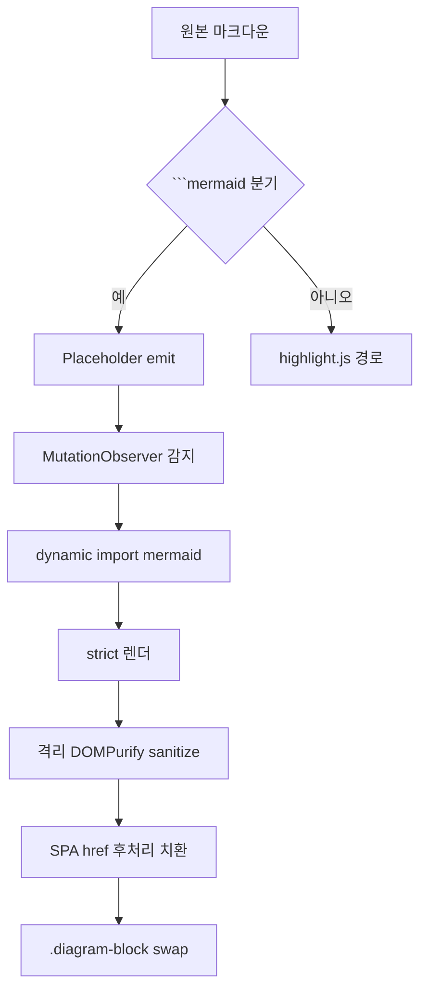
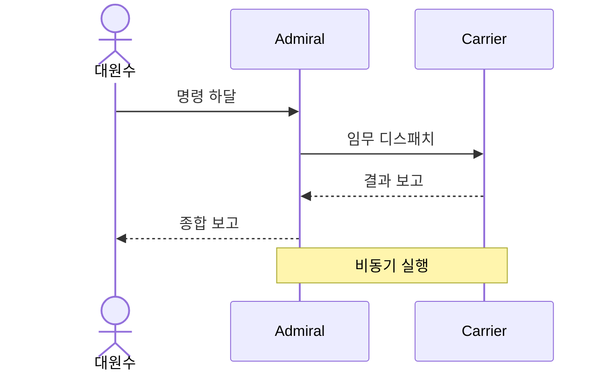
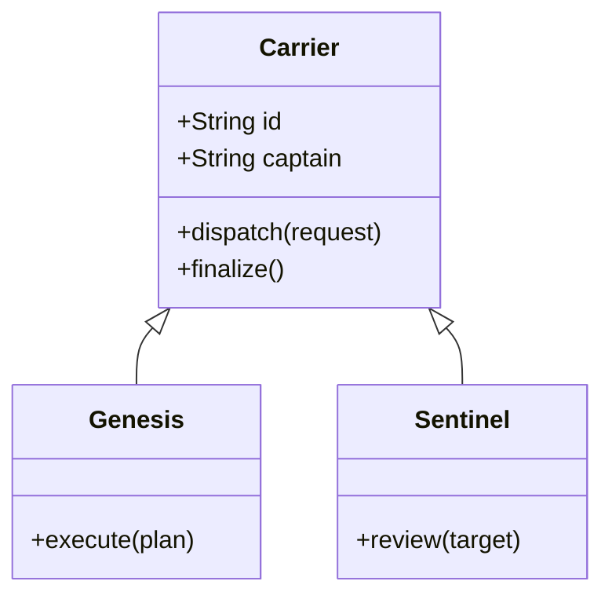
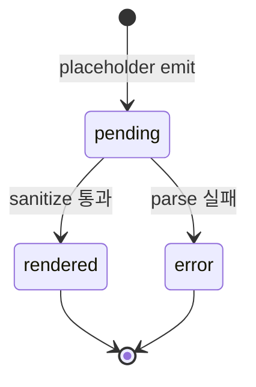
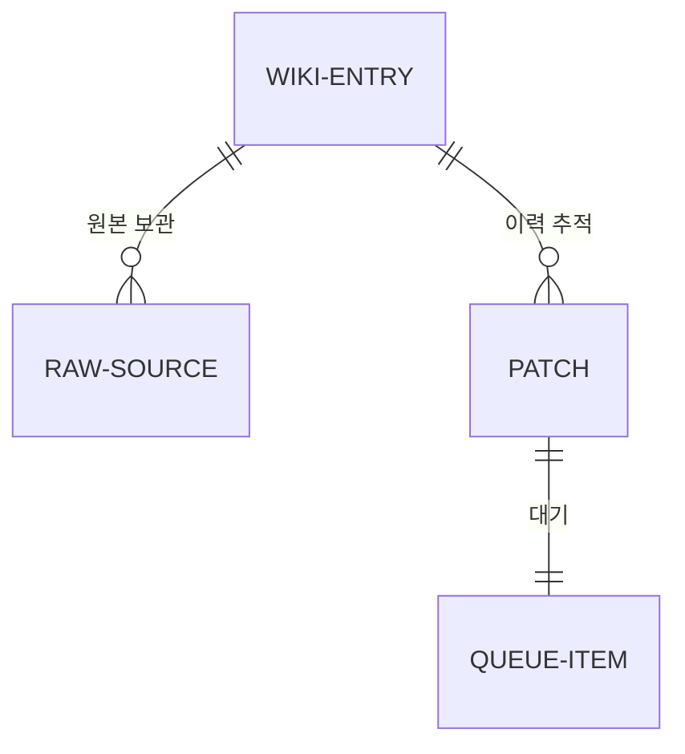
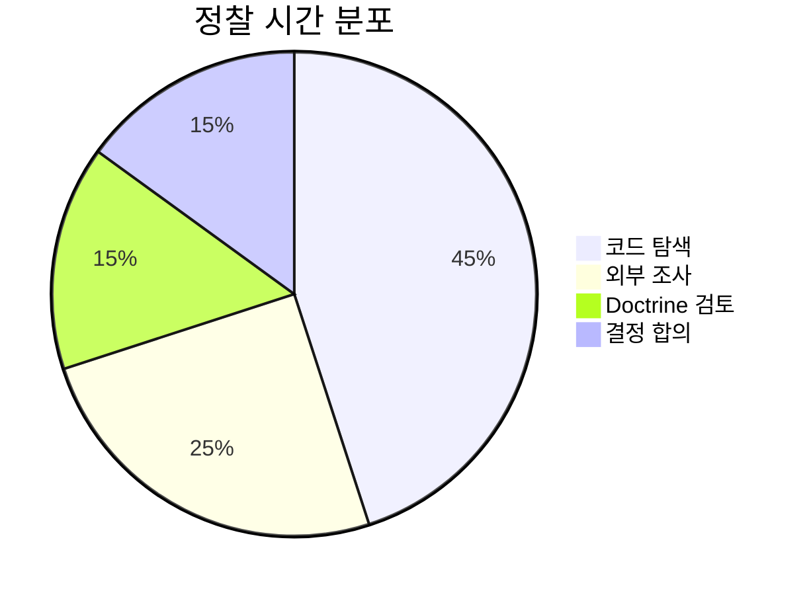

# Mermaid 렌더 회귀 테스트

이 문서는 fleet-wiki-web의 Mermaid v11 통합이 Maritime Codex 시각 doctrine과 보안 invariant를 모두 만족하는지 시각적으로 확인하기 위한 회귀 테스트 entry이다.

## 1. Flowchart — 한글 라벨



## 2. Sequence Diagram — 한글 라벨



## 3. Class Diagram



## 4. State Diagram — 다이어그램 hydration 라이프사이클



## 5. ER Diagram



## 6. Pie Chart — 한글 라벨



## 7. 일반 코드 블록 (회귀 비교용)

다이어그램 블록과 코드 블록의 시각 분리(eyebrow / 툴바 / 색상)가 확실히 구분되는지 비교한다.

```typescript
export function installDiagramHydrator(root: ParentNode): void {
  const observer = new MutationObserver(scan);
  observer.observe(root, { childList: true, subtree: true });
  scan();
}
```

## 8. 인접 컨텍스트

본문 텍스트와 다이어그램이 같은 [[wiki:mermaid-render-test]] 문서 안에서 자연스럽게 섞이는지(스태거 reveal 애니메이션이 다이어그램 hydrate와 충돌하지 않는지) 확인한다. 모바일 폭에서도 다이어그램이 컬럼을 넘치지 않아야 한다.

## 9. 의도적 파싱 실패 (error state 격리 확인)

```mermaid
flowchart TD
    이것은 -- 잘못된 -> 문법
    --
```

위 블록이 `.diagram-block`의 error 상태로 격리되어 표시되며, 이 문서의 다른 다이어그램과 본문 paint에는 영향을 주지 않아야 한다.

## 10. 검증 항목 (수동 시각 QA)

- 각 `.diagram-block` 상단에 brass→aurora 1px hairline 존재
- eyebrow 라벨 `MANIFEST · DIAGRAM`이 JetBrains Mono 대문자로 표시
- 노드 보더는 brass, 엣지는 aurora-deep 톤
- 한글 라벨이 깨지거나 포커스 잃지 않음
- 모바일 폭에서 SVG가 컬럼 밖으로 넘치지 않음
- error state의 `--coral` 색상 적용
- 일반 코드 블록은 macOS 점 + "복사" 버튼 그대로
- pending 상태의 시각적 신호(스피너 등) 1초 이내 rendered로 전환