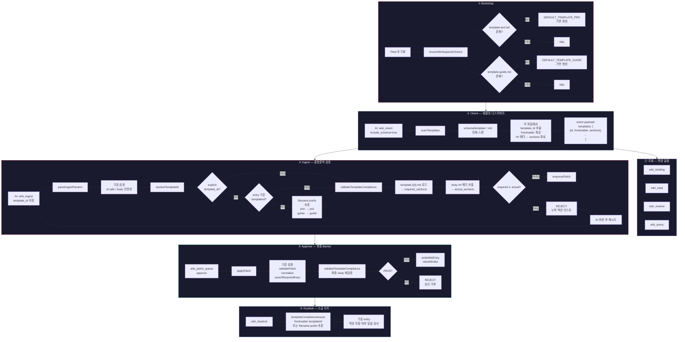

## Overview

fleet-wiki의 단일 `wiki-schema.md` 기반 body section 가이드를 **문서 유형별 템플릿 파일**(`template-*.md`)로 세분화하고, `wiki_ingest` 및 **승인 경로**에서 **결정론적 섹션 검증**을 수행하도록 변경한다. 기존에 LLM 자율 준수(soft guide)에 의존하던 body section 규칙을 코드 강제(hard gate)로 전환하여 wiki entry 품질을 보장한다.

## Problem

현재 wiki-schema 시스템에는 다음 구조적 문제가 있다:

1. **단일 스키마, 다양한 문서 유형**: `wiki-schema.md`가 9개 PRD 섹션을 정의하지만, guide 문서는 이 섹션 구조를 전혀 따르지 않는다. 현재 10개 PRD 중 5개가 `Open Questions` 섹션을 누락한 상태로 운영 중이다.
2. **LLM 자율 준수 의존**: body section 포함 여부는 코드 검증 없이 `WIKI_SCHEMA_PROMPT_NOTE`를 통한 LLM prompt 주입에만 의존한다.
3. **schema.ts ↔ wiki-schema.md drift**: 부트스트랩 시 `wx` flag로 최초 1회만 생성하고 이후 업데이트하지 않아, `lifecycle`(문서에만 필수), `status` deprecated 여부 등에서 코드-문서 간 불일치가 발생한다.
4. **확장성 부재**: 새로운 문서 유형(ADR, Runbook 등)을 추가할 때 wiki-schema.md를 수정해야 하며, 유형별 섹션 규칙을 분리할 수 없다.
5. **승인 경로 우회 가능**: `wiki_patch_edit`으로 body를 직접 수정하면 ingest 검증을 거치지 않고 approve할 수 있어, 템플릿 규칙을 우회할 수 있다.

## Goals

- 문서 유형별 독립 템플릿 파일(`template-*.md`)을 통해 섹션 규칙을 세분화한다.
- 템플릿은 **body 섹션**과 **프론트매터 기본값**을 모두 정의할 수 있으며, 프론트매터는 `wiki-schema.md`의 기본 정의를 override한다.
- `wiki_ingest`에서 `template_id` 기반 결정론적 섹션 포함 검증(⊆ 관계)을 수행한다.
- `applyPatch()` 승인 경로에서도 동일한 `validateTemplateCompliance()` barrier를 적용하여 우회를 차단한다.
- `wiki_orient`가 워크스페이스의 N개 템플릿을 AI에게 전달하여 문서 작성 전 템플릿 선택 근거를 제공한다.
- `schema.ts`를 템플릿 Registry의 Single Source of Truth(SSoT)로 승격한다.
- 부트스트랩 시 `template-prd.md`와 `template-guide.md`를 기본 제공한다.
- 사용자가 `template-` 프리픽스 컨벤션만 준수하면 자유롭게 템플릿을 확장할 수 있도록 한다.

## Non-Goals

- 기존 `wiki-schema.md`의 공통 규칙(frontmatter, 금지사항, 링크 문법)을 템플릿으로 이동하지 않는다.
- 섹션 **순서** 검증은 이번 스코프에 포함하지 않는다 — 포함 여부(⊆)만 검증한다.
- 템플릿 프론트매터는 AI 가이드라인으로만 제공하며, **결정론적 검증은 수행하지 않는다** — 섹션 검증만 hard gate이다.
- 소급 무효화 방지 메커니즘(`template_version`, template hash 등)은 이번 스코프에 포함하지 않는다. 템플릿 변경 후 기존 entry는 다음 update 시점에 자연 보정된다.
- MCP tool description 외 carrier doctrine/system prompt 변경은 포함하지 않는다.

## User Stories

- AI(Admiral/Carrier)로서, `wiki_orient` 호출 시 워크스페이스에 존재하는 모든 템플릿과 각 템플릿의 프론트매터 기본값 및 필수 섹션 목록을 받아, 문서 작성 전 적합한 템플릿을 선택할 수 있다.
- AI(Chronicle 등)로서, `wiki_ingest` 호출 시 `template_id`를 지정하면, 본문이 해당 템플릿의 필수 섹션을 모두 포함하는지 결정론적으로 검증받아, 누락 시 구체적인 에러 메시지를 받을 수 있다.
- AI로서, 템플릿에 정의된 프론트매터 기본값을 참고하여 entry 작성 시 적절한 프론트매터를 구성할 수 있다. 이 기본값은 `wiki-schema.md`의 공통 정의를 override한다.
- AI로서, `template_id`를 명시하지 않아도 기존 entry의 `templateId` 또는 filename prefix 기반으로 적절한 템플릿이 추론되어, 하위 호환성이 유지된다.
- 사용자로서, `.fleet/knowledge/schema/` 폴더에 `template-adr.md` 같은 커스텀 템플릿을 추가하면, 별도 코드 수정 없이 `wiki_ingest`와 `wiki_orient`가 이를 자동으로 인식한다.
- 사용자로서, `wiki_patch_edit`으로 body를 수정한 뒤 approve해도, 승인 시점에 템플릿 검증이 재실행되어 섹션 누락 entry가 승인되지 않는다.
- 사용자로서, Fleet 초기화 시 `template-prd.md`와 `template-guide.md`가 자동 생성되어 즉시 활용할 수 있다.

## Functional Requirements

### 템플릿 파일 구조

- 경로: `.fleet/knowledge/schema/template-{id}.md`
- 컨벤션: `template-` 프리픽스 필수, `{id}` 부분이 `template_id`로 사용됨
- 내용 구조:
  - **프론트매터(선택)**: YAML frontmatter로 해당 문서 유형의 기본 프론트매터 값을 정의. `wiki-schema.md`의 공통 프론트매터 정의를 override함. 결정론적 검증은 수행하지 않으며, AI가 entry 작성 시 참고하는 가이드라인으로 기능함.
  - **body 섹션(필수)**: `## 섹션명` 헤더를 열거. 이 섹션 목록이 결정론적 검증의 대상이 됨.

### AI 활용 플로우 (Mermaid)

### 템플릿 프론트매터 Override 메커니즘

- 템플릿 파일은 YAML frontmatter 블록을 선택적으로 포함할 수 있다.
- 템플릿 프론트매터에 정의된 키-값 쌍은 `wiki-schema.md`의 공통 프론트매터 정의를 override한다.
- Override 우선순위: **템플릿 프론트매터 > wiki-schema.md 공통 정의**
- 프론트매터는 결정론적 검증 대상이 아니며, AI가 entry 작성 시 참고하는 가이드라인으로만 기능한다.
- `wiki_orient`가 각 템플릿의 프론트매터 기본값을 AI에게 전달하여, AI가 entry 작성 시 적절한 프론트매터를 구성할 수 있도록 한다.

### schema.ts — 템플릿 Registry SSoT 승격

- `DEFAULT_WORKSPACE_WIKI_SCHEMA`에서 9개 body section 정의를 제거하고, 공통 규칙만 보존
- `DEFAULT_TEMPLATE_PRD`, `DEFAULT_TEMPLATE_GUIDE` 상수를 신설하여 기본 템플릿 내용(프론트매터 기본값 + 섹션) 정의
- `ensureWorkspaceSchema()` 확장: `template-prd.md`, `template-guide.md` 존재 여부 확인 후 부재 시 기본 생성
- 런타임 `scanTemplates()` 함수 신설: `.fleet/knowledge/schema/template-*.md` glob 스캔 → `{ id, frontmatter, sections }[]` 반환

### template_id resolver 순서

`wiki_ingest` 및 `applyPatch()`에서 template_id를 결정하는 우선순위:

1. **explicit** — 호출 시 명시된 `template_id` 파라미터
2. **entry 기존값** — update 시 기존 entry frontmatter의 `templateId`
3. **filename prefix 추론** — `prd-xxx.md` → `"prd"`, `guide-xxx.md` → `"guide"`

### wiki_orient 변경

- `include_schema=true` (기본값) 시 `scanTemplates()` 호출
- orient payload에 `templates` 배열 포함: `{ id: string, frontmatter: Record<string, unknown>, sections: string[] }[]`

### wiki_ingest 변경

- `template_id` 파라미터 추가 (optional — resolver로 fallback)
- `validateTemplateCompliance(template_id, body)` 검증 함수 신설:
  1. `template-{template_id}.md` 파일 로드, 없으면 에러
  2. 템플릿에서 `##` 헤더 파싱 → `required_sections`
  3. body에서 `##` 헤더 파싱 → `actual_sections`
  4. `required_sections ⊆ actual_sections` 검증
  5. 실패 시 누락 섹션 목록과 함께 reject

### 승인 경로 barrier 추가

- `applyPatch()` 내에서 `serializeWikiEntry()` 직전에 `validateTemplateCompliance()` 호출
- 최종 body가 entry의 `templateId`에 매핑된 템플릿의 필수 섹션을 충족하는지 재검증
- `wiki_patch_edit` → approve 경로의 우회를 차단

### wiki_compile_source / wiki_query 파급

- `wiki_compile_source`는 `wiki_ingest`를 재사용하지 않고 직접 WikiEntry patch를 구성하므로, patch 생성 시 `template_id`를 바인딩해야 함
- `wiki_query`의 `stage_answer_page` 모드도 동일하게 `template_id` 바인딩 필요
- 양 도구 모두 `applyPatch()` 최종 barrier에서 통합 검증됨

### WikiEntryFrontmatter 타입 변경

- `types.ts`에 `templateId?: string` 추가
- `store.ts`의 `serializeWikiEntry()`/`parseWikiEntry()`에서 `template_id` 필드 직렬화/파싱
- `REQUIRED_WIKI_FRONTMATTER_KEYS`는 변경하지 않음 (하위 호환성)

### 부트스트랩 변경

- `ensureWorkspaceSchema()`에서 `template-prd.md`, `template-guide.md` 존재 여부 확인 후 부재 시 기본 생성
- `DEFAULT_TEMPLATE_PRD`: 프론트매터(lifecycle 등 PRD 기본값) + Overview, Problem, Goals, Non-Goals, User Stories, Functional Requirements, Acceptance Criteria, Open Questions, Related
- `DEFAULT_TEMPLATE_GUIDE`: 프론트매터(guide 기본값) + Overview, Related

### drydock 린트 확장

- `templateComplianceIssues()` 함수 신설
- entry의 frontmatter `templateId` 또는 filename prefix로 template_id 추론
- 해당 template의 섹션 포함 여부 일괄 검사
- 기존 `schemaViolationIssues()` 파이프라인에 통합

### 검증 레이어 전환

| 항목 | Before (soft guide) | After (hard gate) |
|------|--------------------|--------------------|
| body section 포함 | wiki-schema.md + LLM prompt | template-{id}.md + validateTemplateCompliance() |
| 검증 시점 | 없음 (AI 자율) | ingest 시 + approve 시 이중 검증 |
| 우회 가능성 | wiki_patch_edit → approve 우회 가능 | applyPatch() barrier로 차단 |
| 에러 피드백 | 없음 | 누락 섹션 리스트 반환 |
| 프론트매터 기본값 | wiki-schema.md 일괄 | 템플릿별 override (가이드라인, 비검증) |
| 확장성 | wiki-schema.md 단일 수정 | template-*.md 파일 추가만으로 확장 |

## Acceptance Criteria

- [ ] `template-prd.md`, `template-guide.md`가 부트스트랩 시 자동 생성된다.
- [ ] 템플릿 파일은 프론트매터(선택)와 body 섹션(필수)을 모두 포함할 수 있다.
- [ ] 템플릿 프론트매터는 `wiki-schema.md`의 공통 정의를 override하며, AI 가이드라인으로 제공된다.
- [ ] 사용자가 `template-*.md` 파일을 추가하면 `wiki_orient`와 `wiki_ingest`가 자동 인식한다.
- [ ] `wiki_orient`(include_schema=true) 호출 시 모든 템플릿의 id, frontmatter 기본값, sections 목록이 반환된다.
- [ ] `wiki_ingest` 호출 시 `template_id`를 지정하면, 본문의 섹션이 해당 템플릿의 섹션을 포함하는지 결정론적으로 검증한다.
- [ ] `template_id` 미지정 시 resolver 순서(explicit → entry 기존값 → filename prefix)로 자동 추론된다.
- [ ] 템플릿 필수 섹션이 누락된 문서를 ingest 시도하면, 누락 섹션 목록과 함께 reject된다.
- [ ] `wiki_patch_edit`으로 body를 수정한 뒤 approve해도, `applyPatch()` barrier에서 템플릿 검증이 재실행된다.
- [ ] 존재하지 않는 `template_id`를 지정하면 명확한 에러가 반환된다.
- [ ] 템플릿에 정의되지 않은 추가 섹션은 허용된다 (⊆ 관계, 완전 일치가 아님).
- [ ] `wiki_compile_source`와 `wiki_query(stage_answer_page)`가 생성하는 patch에도 `template_id`가 바인딩된다.
- [ ] 기존 `wiki-schema.md`의 공통 규칙(frontmatter, 금지사항, 링크 문법)은 그대로 유지된다.
- [ ] `WikiEntryFrontmatter`에 `templateId`가 optional 필드로 추가되고 정상 직렬화/파싱된다.

## Open Questions

- `wiki_compile_source`와 `wiki_query`가 생성하는 entry에 어떤 `template_id`를 기본 바인딩할지 (별도 template 정의 vs 기존 template 재사용)
- `wiki_drydock`에서 기존 entry의 소급 템플릿 린트를 filename prefix 기반으로 자동 수행할지, `templateId` frontmatter가 있는 entry만 대상으로 할지
- 기존 5/10 PRD의 `Open Questions` 섹션 누락을 마이그레이션으로 일괄 보정할지, 다음 update 시 자연 보정할지

## Related

- [[wiki:guide-003-fleet-wiki]] — Fleet Wiki 워크플로우 가이드
- [[wiki:prd-core-dismantling-di-architecture]] — DI 아키텍처 PRD (wiki 구조 관련 참조)