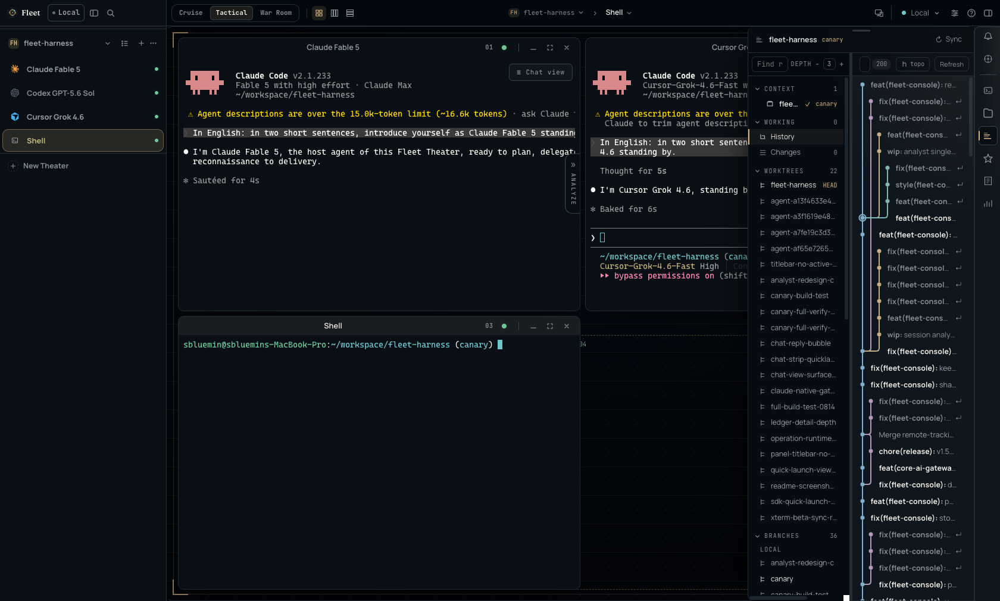
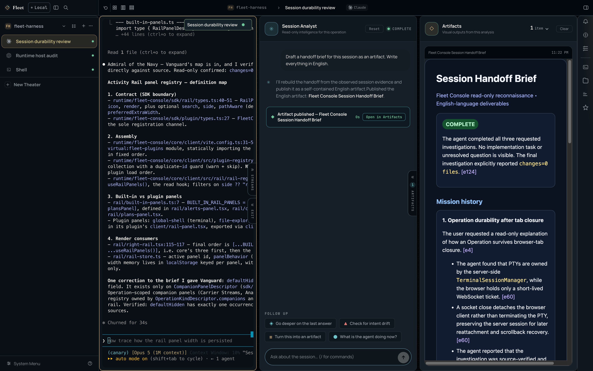

<p align="center">
  
</p>

<h1 align="center">하나의 콘솔. 모든 프론티어 코딩 에이전트.</h1>

<p align="center">
  <strong>Fleet Console은 Claude Code와 Claude Gateway를 서버가 소유하는 살아 있는 Operation으로 실행합니다.</strong><br/>
  하나의 로컬 워크스페이스에서 배치하고, 관측하고, 위임할 수 있습니다.<br/>
  네이티브 에이전트 런타임. 공식 프로토콜. 공급자 자격은 에이전트 프로세스에 들어가지 않음.
</p>

<p align="center">
  <a href="https://www.npmjs.com/package/@dotobokuri/fleet-console"></a>
  <a href="./LICENSE"></a>
  <br/>
  <a href="README.md">English</a> · <a href="README.ko.md">한국어</a>
</p>

## 한 번의 명령으로 시작

Node.js 20.19+ 와 `PATH`에 등록된 인증 완료 에이전트 CLI가 하나 이상 필요합니다.

```bash
npm install -g @dotobokuri/fleet-console

fleet-console          # 로컬 콘솔을 시작하고 브라우저로 엽니다
```

`fleet-console`은 `status`, `restart`, `stop`도 지원합니다. 모든 실행은 내 머신 안에서 이루어집니다. 서버는 기본적으로 루프백에 바인딩되고, 브라우저에는 MCP·공급자 토큰이 전달되지 않습니다. 원격 접속은 켜기 전까지 꺼져 있으며, 켜면 직접 고른 인터페이스에 TLS로 콘솔을 엽니다.

네이티브 창을 원한다면 [최신 GitHub Release](https://github.com/sbluemin/fleet-harness/releases/latest)에서 플랫폼 빌드를 설치하세요.

## 탭을 닫아도 에이전트는 계속 일합니다

**Operation**은 브라우저가 아니라 로컬 Fleet Console 서버가 소유하는 실제 터미널 세션입니다. 탭을 닫으면 소켓만 분리되고, PTY는 계속 실행되며 출력도 계속 쌓입니다. 콘솔을 다시 열면 세션이 스크롤백을 재생하고 하던 일을 이어갑니다.

유휴 에이전트는 방치되지 않고 회수됩니다. 직접 지정한 임계 시간이 지나면 조용한 세션은 휴면 상태로 내려가고, 클릭 한 번으로 되살아납니다. Operation을 닫거나 Theater를 등록 해제해도 몇 초 동안은 되돌릴 수 있어 오조작에 비용이 들지 않습니다.

**Theater**는 프로젝트 폴더입니다. 작업하는 만큼 등록해 두면 모든 패널과 세션, 도구가 활성 Theater를 따라갑니다.

## 같은 캔버스를 쓰는 세 가지 방식

Operation은 무한 캔버스 위에 놓이고, 커맨드 밴드의 스위치가 배치를 어디까지 직접 할지 정합니다.

| 모드 | 하는 일 | 단축키 |
|---|---|---|
| **Cruise** | 패널을 원하는 자리에 직접 배치 | — |
| **Tactical** | 모든 패널을 한 번에 정렬 | <kbd>Alt</kbd>+<kbd>F</kbd> |
| **War Room** | 대기 중인 패널을 한 건씩 처리 | <kbd>Alt</kbd>+<kbd>T</kbd> |

여러 에이전트가 동시에 응답을 기다릴 때는 War Room입니다. Operation을 한 번에 하나씩 무대에 올리고 나머지는 큐에 두며, <kbd>Alt</kbd>+<kbd>→</kbd>로 순서를 잃지 않고 뒤로 미룰 수 있습니다. <kbd>Alt</kbd>+<kbd>S</kbd>는 사이드바를 Operation 상태로 정렬해 작업 중·대기·유휴를 한눈에 보여줍니다.

<kbd>⌘</kbd>+<kbd>K</kbd>는 모든 Theater에 걸쳐 Operation을 검색합니다. <kbd>⌘</kbd>+<kbd>P</kbd>는 커맨드 팔레트를 열어 재개·닫기·최소화·이름 변경·그룹 변경·액센트 변경·모드 전환 같은 동작을 곧바로 실행합니다.

## 프로젝트 컨텍스트를 터미널 옆에



Activity Rail에는 **Alerts, Codex, Shell, Files, Repository, Skills, Ledger, Usage limits** 8개 패널이 기본 탑재되며, 설치한 플러그인이 자체 패널을 더할 수 있습니다. Repository 패널 하나로 활성 Theater의 히스토리, 작업 변경분, 비교, 워크트리, 브랜치, 태그, 스태시를 감독 중인 Operation을 떠나지 않고 확인할 수 있습니다. Ledger와 Usage limits는 토큰 사용량과 프로바이더 쿼터를 같은 레일에 두어, 창이 차오르는 것을 실행이 멈추기 전에 알아챌 수 있게 합니다. 각 패널은 자기 너비를 기억하며, 캔버스를 밀어내는 대신 그 위에 띄울 수도 있습니다.

## 세션을 건드리지 않고 세션에 대해 묻기



**Session Analyst**는 개별 Operation을 위한 읽기 전용 인텔리전스입니다. 무슨 일이 있었는지 되짚거나, 검토가 필요한 지점을 짚거나, 인수인계 브리핑을 작성하도록 지시하세요. 호스트 에이전트를 건드리지 않고 세션을 읽어 답합니다. 분량이 큰 결과물은 **Artifacts** 컴패니언으로 발행됩니다. 근거가 인용된 문서가 렌더링되어 세션 옆 전용 창에 남습니다. 분석기 자신이 사용할 CLI·모델·추론 강도도 직접 고를 수 있습니다. 감독 중인 모델과 같을 필요는 없습니다.

## 네이티브 런타임을 대체하지 않고 조율

Fleet은 선언된 제품 표면에서 실제 CLI 바이너리를 실행하고 지원 프로토콜로 통신하므로, 제작사가 다듬은 모델 네이티브 에이전트 루프와 이미 사용 중인 기능·인증을 그대로 보존합니다. Agent Operation은 두 가지 종류로 시작합니다.

| 실행 종류 | 무엇을 실행하나 |
|---|---|
| **Claude (Native)** | 순정 Claude Code — Console 훅과 Wiki 스킬만 덧붙습니다 |
| **Claude (Gateway)** | 설정에서 켠 모델로 구동되는 Claude Code |

게이트웨이는 API 프록시가 아니라 로컬 Claude Code 엔드포인트입니다. 상류 요청은 Console이 직접 보내고, 어떤 프로바이더의 자격 증명도 Claude Code 프로세스에 들어가지 않습니다. Codex와 Cursor는 이미 쓰던 구독을 타고, Kimi와 OpenCode Go는 설정에 등록한 API 키를 씁니다.

| 프로바이더 | 게이트웨이로 닿는 모델 |
|---|---|
| **Codex** | GPT-5.6 Sol · Terra · Luna, 각각 Fast 변형 |
| **Cursor** | Composer 2.5 · Grok 4.5 · GPT-5.6 Sol · Claude Opus 5 · Claude Fable 5 · Kimi K3 · Auto |
| **Moonshot-Kimi** | Kimi K3, K3 256K |
| **OpenCode** | MiniMax M3 · Qwen3 Max · DeepSeek V4 · GLM-5 · Kimi K3 · MiMo · Grok 4.5 · GPT-5.6 Luna |

무엇을 노출할지는 Settings → Plugins → Terminal → **AI Gateway**에서 고릅니다. 여기서 켠 모델만 Claude Code의 `/model` 피커와 실행 기본값에 나타나며, 모델을 펼치면 어떤 추론 강도로 제공할지까지 지정할 수 있습니다.

## 내 취향대로

라이트와 다크 중에 고르고, 다크라면 **Instrument**·**Maritime**·**Carbon** 중 방에 맞는 톤을 고르세요. UI 서체와 터미널 서체는 각각 따로 설정하며, 이 기기에 설치된 시스템 폰트까지 선택할 수 있습니다. 콘솔 크롬, 설정, 단축키, 기본 플러그인까지 한국어와 영어를 모두 지원하며 새로고침 없이 즉시 전환됩니다.

Fleet Wiki는 아키텍처 결정, 제품 히스토리, 리뷰 큐를 실행 환경과 같은 워크스페이스에 보존해, 변경의 근거가 그것을 만든 트랜스크립트보다 오래 남게 합니다.

## Fleet Console Desktop — 필요할 때 네이티브로

Fleet Console Desktop은 Fleet Console 위의 선택적 얇은 네이티브 셸이며, 두 번째 서버나 분기된 UI가 아닙니다. 표준 Console 서비스를 감독하고, 창을 넘기기 전에 그 원본을 정확히 검증한 뒤 — 루프백 콘솔이거나, 로컬 Console이 들고 있는 지문과 살아 있는 인증서가 일치하는 원격 콘솔 — 샌드박스 처리된 Node-free 렌더러에서 같은 `/console/` 제품을 로드합니다.

- 네이티브 창, 트레이 라이프사이클, 플랫폼 업데이트 흐름
- 사용자 상태와 독립적으로 교체 가능한 관리형 Node·Console 런타임
- 위에서 본 것과 동일한 Operations, Activity Rail, 컴패니언, 설정
- 브라우저 채널과 안전하게 공존하며 검증되지 않은 Console 프로세스를 종료하지 않음

[최신 GitHub Release](https://github.com/sbluemin/fleet-harness/releases/latest)에서 플랫폼 아티팩트를 설치하세요. 아티팩트, 업데이트 동작, 현재 제한은 [Desktop 가이드](runtime/fleet-desktop/README.md)를 참조하세요.

> Fleet Console은 리서치 프리뷰입니다.

## 더 알아보기

- [Fleet 개발 레퍼런스](docs/fleet-development-reference.md) — 호스트 확장과 SDK
- [제독 워크플로 레퍼런스](docs/admiral-workflow-reference.md) — 오케스트레이션 아키텍처와 원칙
- [변경 이력](CHANGELOG.ko.md) — 릴리스 히스토리

## 라이선스

MIT
