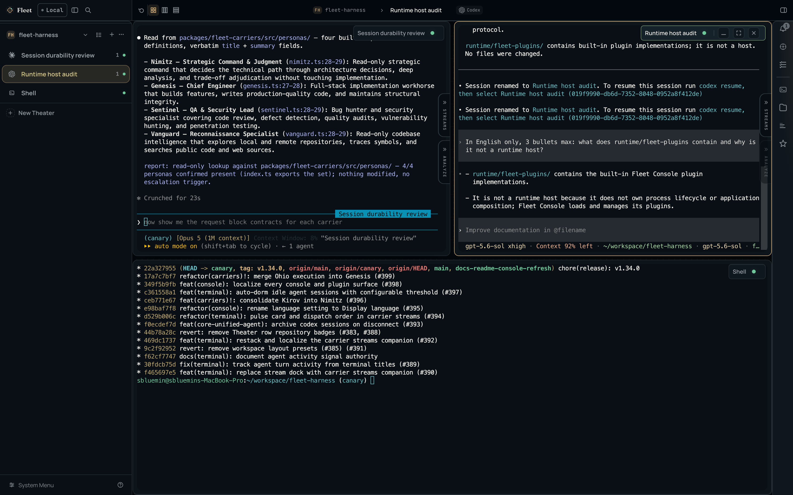
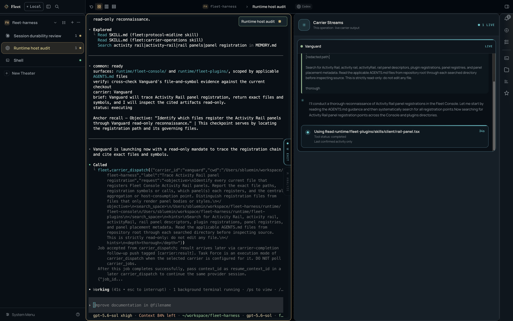

<p align="center">
  
</p>

<h1 align="center">One console. Every frontier coding agent.</h1>

<p align="center">
  <strong>Fleet Console runs Claude Code, Codex, OpenCode, and Cursor Agent as live, server-owned operations</strong><br/>
  you can arrange, observe, and delegate from one local workspace.<br/>
  Native agent runtimes. Official protocols. No API wrapping or proxying.
</p>

<p align="center">
  <a href="https://www.npmjs.com/package/@dotobokuri/fleet-console"></a>
  <a href="./LICENSE"></a>
  <br/>
  <a href="README.md">English</a> · <a href="README.ko.md">한국어</a>
</p>



## Start in one command

Requires Node.js 20.19+ and at least one authenticated agent CLI on `PATH`.

```bash
npm install -g @dotobokuri/fleet-console

fleet-console          # start the local console and open it in your browser
```

`fleet-console` also takes `status`, `restart`, and `stop`. Everything runs on your machine: the server binds to loopback only, and the browser never receives MCP or session tokens.

Prefer a native window? Install a platform build from the [latest GitHub Release](https://github.com/sbluemin/fleet-harness/releases/latest).

## Your agents keep working after you close the tab

An **Operation** is a real terminal session owned by the local Fleet Console server, not by your browser. Closing the tab detaches the socket; the PTY keeps running and its output keeps buffering. Reopen the console and the session replays its scrollback and carries on.

Idle agents are reclaimed instead of abandoned: after a threshold you choose, a quiet session goes dormant and comes back with one click. Closing an Operation or forgetting a Theater stays undoable for a few seconds, so a misclick costs nothing.

A **Theater** is a project folder. Register as many as you work in — every panel, session, and tool follows the active one.

## Arrange the work, not just the windows

Operations live on an infinite canvas. Drag them where the task wants them, zoom out through the Map, or press <kbd>Alt</kbd>+<kbd>F</kbd> to tile everything into Formation — grid, columns, or rows. <kbd>Alt</kbd>+<kbd>S</kbd> flips the sidebar into a status board so you can see what is working, waiting, or idle at a glance.

<kbd>⌘</kbd>+<kbd>K</kbd> reaches across the whole console: operations, repository commits, files, plans, and skills, plus the actions you would otherwise hunt for — resume, close, minimize, rename, regroup, recolor, switch Formation.

## Keep project context beside the terminal


The Activity Rail ships with seven built-in panels — **Alerts, Codex, Plans, Shell, Files, Repository,** and **Skills** — and installed plugins can contribute their own. The Repository panel alone gives you history, working changes, compare, worktrees, branches, tags, and stashes for the active Theater, without leaving the operation you are supervising. Each panel remembers its own width and can float over the canvas instead of pushing it.

## Watch every delegated carrier as it runs



When an agent delegates work to a **Carrier**, the Carrier Streams companion opens beside that operation and shows the dispatch as it happens: the order that was sent, the answer streaming back, and the tool the carrier is running right now. You no longer have to guess what a background specialist is doing.

## Ask questions about a session without disturbing it


**Session Analyst** is read-only intelligence for a single operation. Ask it to walk through what happened, flag anything worth reviewing, or draft a handoff brief — it reads the session and answers without touching the host agent. Longer outputs are published to the **Artifacts** companion: rendered, evidence-cited documents that live in their own pane beside the session. Pick the CLI, model, and reasoning effort the analyst itself runs on — it does not have to be the model you are supervising.

## Configure every specialist independently


Four built-in Carriers ship with Fleet: **Nimitz** (strategic command and judgment), **Genesis** (chief engineer), **Sentinel** (QA and security), and **Vanguard** (reconnaissance). Under Settings → Plugins → Terminal → Carriers, each one gets its own CLI backend, model, and reasoning effort — so the specialist that audits your security does not have to run on the model that writes your features.

Nimitz and Vanguard additionally support **Task Force**: give either one two or more CLI backends and a single dispatch runs across all of them, so you can compare approaches and surface consensus instead of trusting one model's first answer.

## Native runtimes, coordinated — not replaced

Every supported CLI brings a model-native agent loop refined by its creator. Fleet launches the actual CLI binary and speaks its supported protocol, preserving the capabilities and authentication you already use.

| CLI | Provider | Protocol | Typical strength |
|---|---|---|---|
| **Claude Code** | Anthropic | ACP | Deep reasoning and architecture judgment |
| **Kimi via Claude Code** | Moonshot AI | ACP | Kimi coding models with Claude Code tooling |
| **Codex CLI** | OpenAI | Codex App Server | Rapid implementation and iterative execution |
| **OpenCode Go** | OpenCode | ACP | Broad open-model access |
| **Cursor Agent** | Cursor | ACP | Multi-model routing |

Kimi uses the installed `claude` binary with Moonshot's official Anthropic-compatible endpoint. Register its API key under Settings → Plugins → Terminal → Agent CLI before launching a Kimi session or assigning `claude-kimi` to a Carrier.

Fleet maps that system into a clear command chain: you are the **Admiral of the Navy**, the workspace host acts as **Admiral**, and each specialized **Carrier** is commanded by a Captain persona. The metaphor is more than decoration — it makes ownership, delegation, and verification explicit.

## Make it yours

Three themes — **Instrument**, **Maritime**, and **Carbon** — retune the whole surface, and UI and terminal typography are configurable independently. The console speaks English and Korean across its chrome, settings, shortcuts, and built-in plugins, and switches immediately without a reload.

Fleet Wiki keeps architecture decisions, product history, and review queues in the same workspace as execution, so the reasoning behind a change outlives the transcript that produced it.

## Fleet Console Desktop — native when you want it

Fleet Console Desktop is an optional thin native shell over Fleet Console — not a second server or a forked UI. It supervises the standard Console service, verifies the exact loopback origin, and loads the same `/console/` product in a sandboxed, Node-free renderer.

- Native window, tray lifecycle, and platform update flow
- Managed Node and Console runtime, replaceable independently of user state
- The same Operations, Activity Rail, companions, and settings shown above
- Coexists safely with the browser channel and never terminates an unverified Console process

Install a platform artifact from the [latest GitHub Release](https://github.com/sbluemin/fleet-harness/releases/latest). See the [Desktop guide](runtime/fleet-desktop/README.md) for artifacts, update behavior, and current limits.

> Fleet Console is a research preview.

## Go deeper

- [Fleet Development Reference](docs/fleet-development-reference.md) — extend hosts and use the SDK
- [Admiral Workflow Reference](docs/admiral-workflow-reference.md) — orchestration architecture and doctrine
- [Changelog](CHANGELOG.md) — release history

## License

MIT
