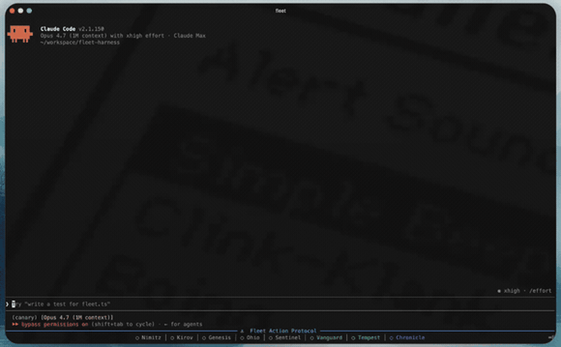
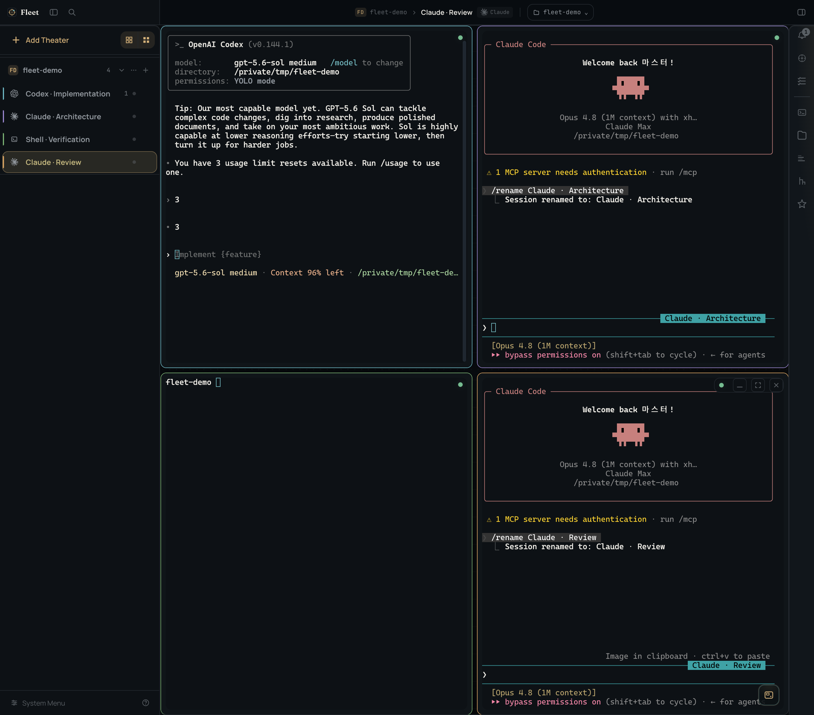
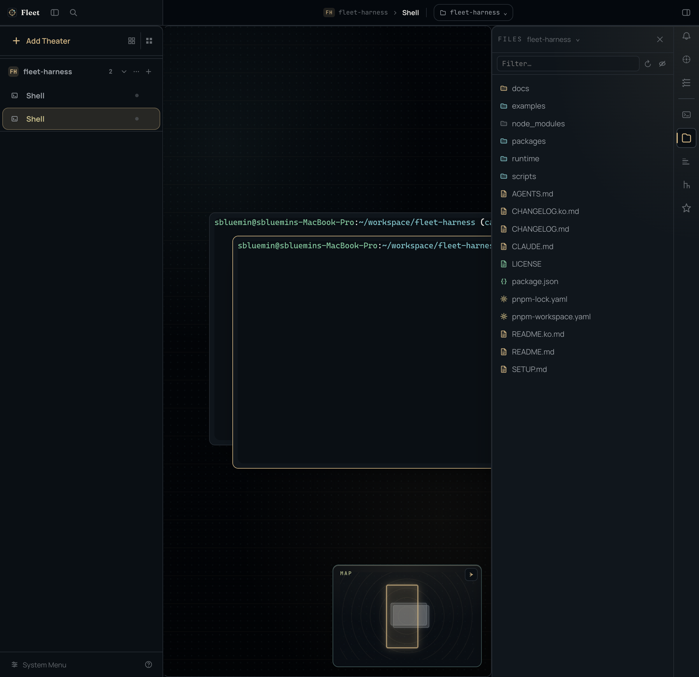
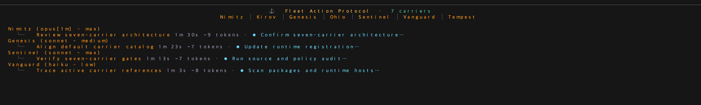
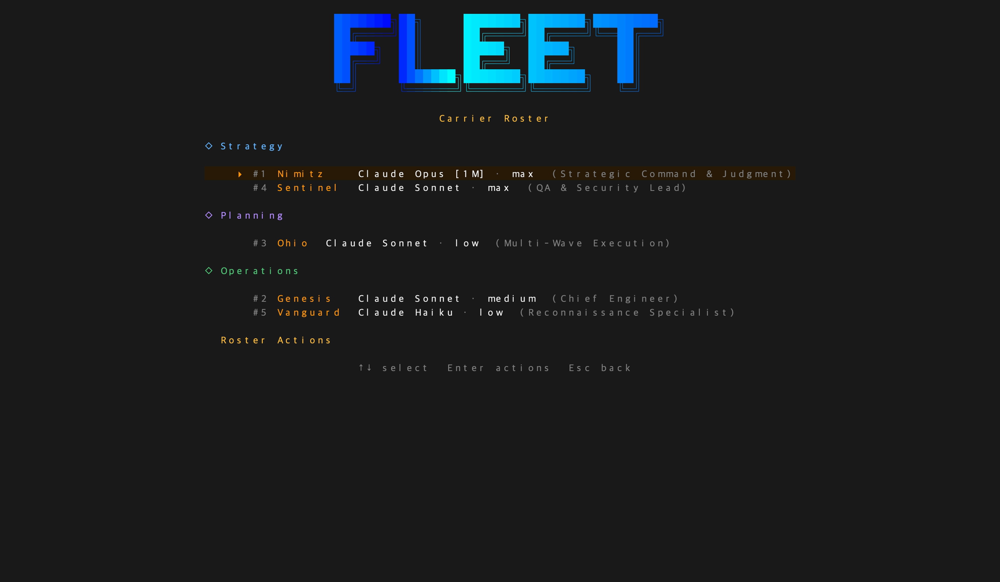
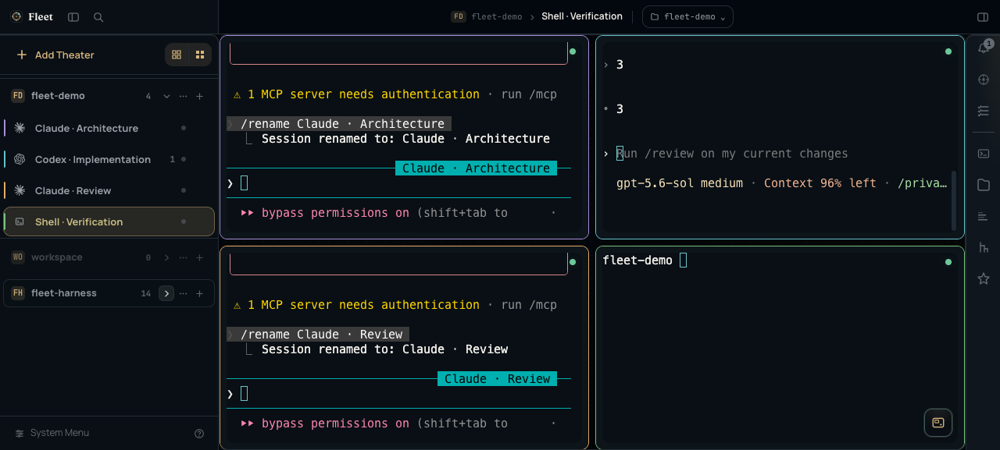

<p align="center">
  
</p>

<h1 align="center">One Fleet. Every frontier CLI.</h1>

<p align="center">
  <strong>Command Claude Code, Codex, OpenCode, and Cursor Agent from one local fleet.</strong><br/>
  Native agent runtimes. Official protocols. No API wrapping or proxying.
</p>

<p align="center">
  <a href="https://www.npmjs.com/package/@dotobokuri/fleet-cli"></a>
  <a href="./LICENSE"></a>
  <br/>
  <a href="README.md">English</a> · <a href="README.ko.md">한국어</a>
</p>

<div align="center">
  
</div>

## One command center, three ways to work

Fleet preserves the native agent loop behind every CLI, then gives you one place to plan, dispatch, observe, and compare their work.

| Product | Start with | Made for |
|---|---|---|
| **Fleet CLI** | `fleet` | A fast, keyboard-first command center that stays in your terminal |
| **Fleet Console** | `fleet console` | Spatial multi-agent operations, live terminals, project tools, and visual configuration |
| **Fleet Console Desktop** | [Latest GitHub Release](https://github.com/sbluemin/fleet-harness/releases/latest) | The full Console experience in an optional native window with managed runtime and updates |

All three command the same carriers and orchestration engine. Fleet runs locally; Console is loopback-only, and browser surfaces never receive MCP or session tokens.

## Start your fleet

Requires Node.js 20+ and at least one authenticated supported CLI on `PATH`.

```bash
npm install -g @dotobokuri/fleet-cli

fleet              # terminal command center
fleet console      # local web command center
```

Run `fleet --help` after installation to verify the CLI, then launch the interface you prefer.

## Fleet Console — see the whole operation

Fleet Console turns parallel agent work into a navigable operations space. Every Operation remains a real terminal session owned by the local server, so closing a browser tab does not stop the work.

### Arrange live work spatially



Open multiple Operations on an infinite canvas, arrange them around the task, zoom out through the Map, or switch to Formation to tile Claude, Codex, shell, and other agent runtimes into a focused working set. The Theater sidebar keeps every project and session within reach.

### Bring project context beside the terminal



The Activity Rail places Files, Plans, Diff, History, Skills, alerts, and a global shell beside live Operations. Supported panels share server-persisted Theater path context, so project exploration stays synchronized without exposing raw filesystem paths to the browser.

### Keep decisions, not just transcripts


Fleet Wiki keeps architecture decisions, product history, guides, and review queues in the same workspace as execution. Search and inspect knowledge without leaving the operation.

### Configure every specialist independently


Choose each Carrier's CLI backend, model, reasoning effort, and Task Force composition from the visual roster at Settings > Plugins > Terminal > Carriers. Eight built-in specialists cover strategy, planning, implementation, multi-wave execution, QA, reconnaissance, external intelligence, and documentation.

> Fleet Console is a research preview.

## Fleet CLI — command from the keyboard

Fleet CLI is the terminal-native bridge for planning, dispatching, and monitoring the same fleet without leaving your shell.



The Bridge combines a full editor, live carrier status, session state, token usage, cost, and streamed results in a single keyboard-first view.



Mission Control exposes the Carrier Roster and fleet-wide controls. Launch one specialist with a **Sortie**, dispatch several in parallel, or run a **Task Force** across multiple CLI backends to compare approaches and surface consensus.

## Fleet Console Desktop — native when you want it

Fleet Console Desktop is an optional thin native shell over Fleet Console—not a second server or a forked UI. It supervises the standard Console service, verifies the exact loopback origin, and loads the same `/console/` product in a sandboxed, Node-free renderer.



- Native window, tray lifecycle, and platform update flow
- Managed Node and Console runtime, replaceable independently of user state
- The same Operations, Activity Rail, Carrier Settings, and Fleet Wiki shown above
- Coexists safely with the browser/CLI channel and never terminates an unverified Console process

Install a platform artifact from the [latest GitHub Release](https://github.com/sbluemin/fleet-harness/releases/latest). See the [Desktop guide](runtime/fleet-desktop/README.md) for artifacts, update behavior, and current limits.

## Native runtimes, coordinated—not replaced

Every supported CLI brings a model-native agent loop refined by its creator. Fleet launches the actual CLI binary and communicates through its supported protocol, preserving the capabilities and authentication model you already use.

| CLI | Provider | Protocol | Typical strength |
|---|---|---|---|
| **Claude Code** | Anthropic | ACP | Deep reasoning and architecture judgment |
| **Codex CLI** | OpenAI | ACP | Rapid implementation and iterative execution |
| **OpenCode Go** | OpenCode | ACP | Broad open-model access |
| **Cursor Agent** | Cursor | ACP | Multi-model routing |

Fleet maps that system into a clear command chain: the user is the **Admiral of the Navy**, a workspace host acts as **Admiral**, and each specialized **Carrier** is commanded by a Captain persona. The metaphor is more than decoration—it makes ownership, delegation, and verification explicit.

## Go deeper

- [Fleet Development Reference](docs/fleet-development-reference.md) — extend hosts and use the SDK
- [Admiral Workflow Reference](docs/admiral-workflow-reference.md) — orchestration architecture and doctrine
- [Changelog](CHANGELOG.md) — release history

## License

MIT
