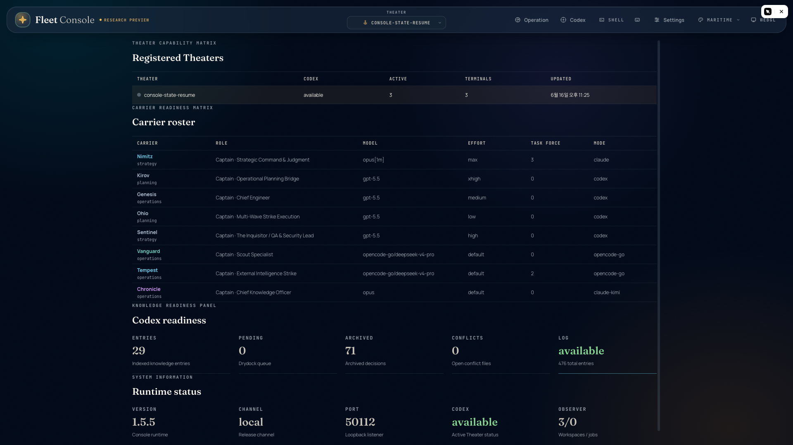
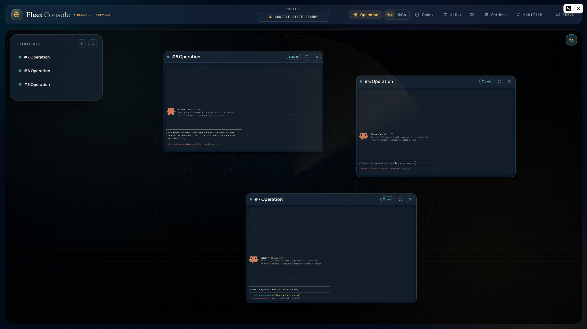
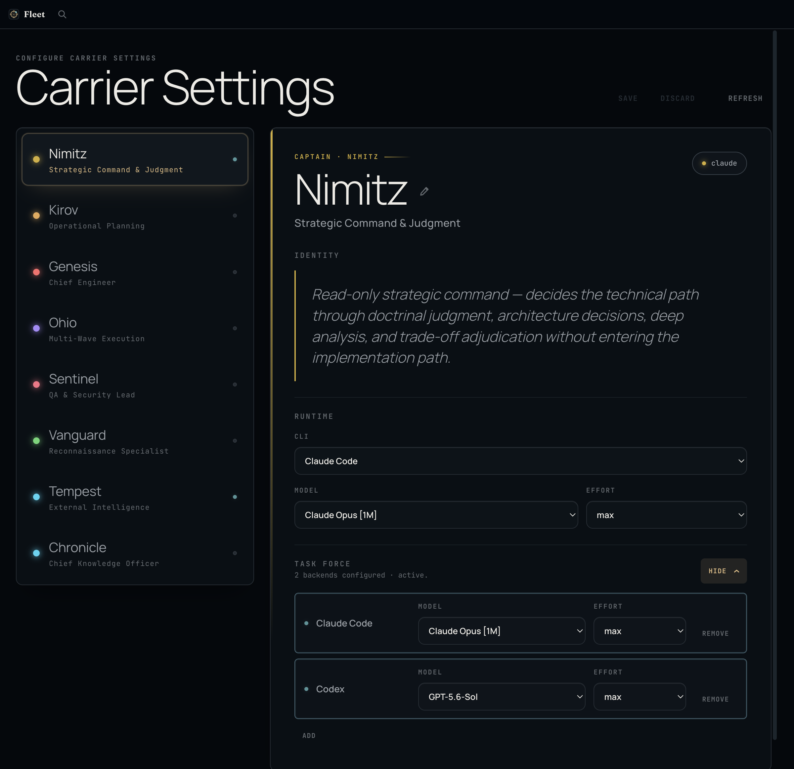
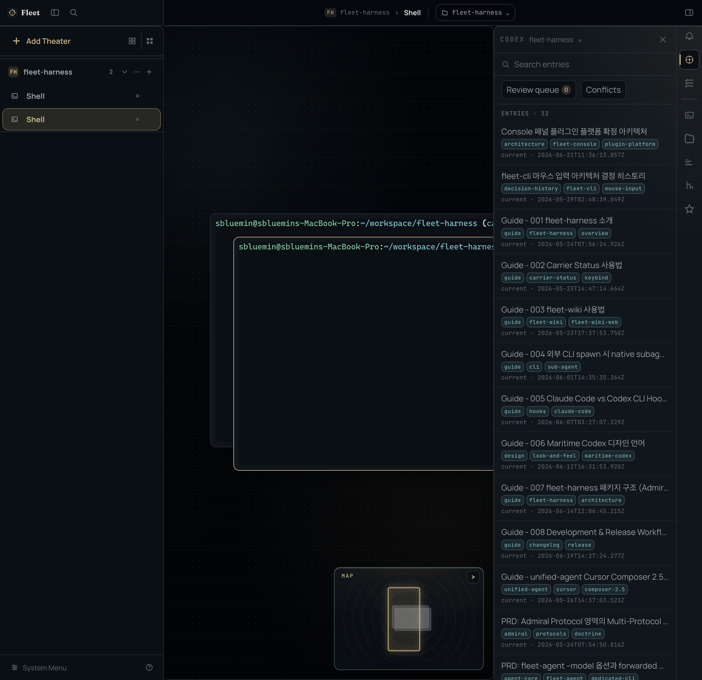

<p align="center">
  <br/>
  ⚓ ─────────── ⚓
  <br/><br/>
  
  <br/><br/>
  <strong>F L E E T</strong>
  <br/>
  <em>One Fleet. All LLMs.</em>
  <br/><br/>
  ⚓ ─────────── ⚓
  <br/>
</p>

<p align="center">
    <strong>A multi-LLM orchestration kit that operates Claude Code and Codex CLI through a single unified interface — in your terminal or a local web console — using native CLIs directly, no API wrapping or proxying.</strong>
</p>

<p align="center">
  <a href="https://www.npmjs.com/package/@dotobokuri/fleet-cli"></a>
  <a href="./LICENSE"></a>
</p>

<p align="center">
  <a href="README.md">English</a> |
  <a href="README.ko.md">한국어</a>
</p>

---

<div align="center">
  
</div>

## Quick Start

Install the Fleet CLI globally via npm:

```bash
npm install -g @dotobokuri/fleet-cli
```

Launch the terminal interface:

```bash
fleet
```

Or open the **Fleet Console** — a local, loopback-only web GUI for the same fleet:

```bash
fleet console
```

See [SETUP.md](SETUP.md) for step-by-step instructions.

> **With an AI Agent** — Copy and paste into your LLM agent:
>
> Install and configure Fleet by following the instructions here: `https://raw.githubusercontent.com/sbluemin/fleet-harness/main/SETUP.md`

## Motivation

Every frontier CLI — Claude Code, Codex, OpenCode, Cursor — ships with an agent loop tuned specifically for its underlying model. Claude's loop is built for deep reasoning and tool orchestration. Codex optimizes for rapid code generation and iterative execution. OpenCode unifies multiple models under one adaptive loop. Cursor routes between multiple frontier models within a single agent loop. These are not thin API wrappers; they are full-fledged, model-native agent runtimes refined by their creators.

The problem is that they all live in separate terminals. To combine their strengths on a single task, you must copy context between windows, manually sync state, and context-switch across different interaction patterns. The friction of multi-tool coordination often forces you to settle for a single CLI, leaving the unique capabilities of the others on the table.

Fleet was built to remove that friction without sacrificing what makes each CLI special. It treats every native agent runtime as a **Carrier** within a naval **Fleet**. A central Admiral orchestrates multiple Carriers in parallel through their official protocols, so each model's native loop runs exactly as designed — just coordinated under one command. You give the order once; the fleet executes together, with every Carrier contributing its distinct strengths.

## Naval Fleet Hierarchy

A 4-tier command structure maps users, orchestrators, and agents into clear roles:

- **Admiral of the Navy** — The user. Sets strategy and gives orders.
- **Fleet Admiral** — Multi-fleet orchestrator policy now hosted inside `fleet-cli`.
- **Admiral** — A workspace agent instance. Plans and dispatches Carriers.
- **Captain** — The commander persona of a Carrier agent.

A **Carrier** is an execution instance of a CLI tool with isolated configuration. A **Captain** is the persona (e.g., Chief Engineer, Scout Specialist) that commands it.

## Carriers

> Per-carrier configuration (model, reasoning level, Task Force, SubAgent mode, etc.) can be adjusted from the **Carrier Settings** surface in the Fleet Console, or the Carrier Roster entry in the CLI's Mission Control menu.

Eight built-in Carriers, each with a distinct operational role:

- **Nimitz** — Strategic Command & Judgment. Read-only architecture decisions and trade-off adjudication.
- **Kirov** — Operational Planning Bridge. Clarifies requirements and authors plan_file under .fleet/plans/*.md for Ohio.
- **Genesis** — Chief Engineer. Single-shot implementation under Admiral direction.
- **Ohio** — Multi-Wave Strike Execution. Consumes Kirov-authored plan_file and executes wave-by-wave to completion.
- **Sentinel** — QA & Security Lead. Code review, defect detection, and vulnerability hunting.
- **Vanguard** — Scout Specialist. Codebase exploration, symbol tracing, and web research.
- **Tempest** — Forward External Intelligence Strike. GitHub intelligence and external repo analysis.
- **Chronicle** — Chief Knowledge Officer. Documentation, changelogs, and change-impact reporting.

## Multi-LLM Orchestration

Fleet does not wrap APIs or run proxies — it orchestrates **native frontier CLI tools directly**. Each carrier spawns the actual CLI binary and communicates through its official protocol (ACP), giving you the full native capabilities of each tool within a unified command structure.

| CLI | Provider | Protocol | Key Capabilities |
|-----|----------|----------|------------------|
| **Claude Code** | Anthropic | ACP | Deep reasoning, architecture judgment |
| **Codex CLI** | OpenAI | ACP | Fast code generation, multi-wave execution |
| **OpenCode Go** | OpenCode | ACP | DeepSeek, GLM, Kimi, MiMo, MiniMax, Qwen |
| **Cursor Agent** | Cursor | ACP | Multi-model routing across frontier models |

Every carrier runs in parallel under a single command structure, with unified progress tracking so you always know the status of the entire fleet. Fine-tune each carrier independently — select models, set reasoning levels, and adjust parameters without leaving the fleet interface. Fleet Action provides the autonomous operating framework for routing, delegation, review, and documentation.

Fleet gives you **two ways to command the same fleet** — the **Fleet Console**, a local web GUI, and the **Fleet CLI**, a terminal interface. Both drive the same carriers, orchestration engine, and project plugins; pick whichever fits the moment.

---

## 🖥️ Fleet Console

`fleet console` opens the Fleet Console — a local web command center for the same fleet you run in the terminal. It runs as a loopback-only server on your own machine (no cloud, no proxy) and serves a live, streaming GUI for observing and operating every carrier. *(Research preview.)*

### Live dashboard



The landing view is a readiness board for the whole operation: a Theater capability matrix (project roots, with Codex and live-terminal status), a carrier readiness matrix showing each carrier's CLI, model, reasoning effort, Task Force, and mode, a Codex knowledge panel, and runtime status — all kept current in real time.

### Operations Map



A free-placement canvas where each carrier terminal is a panel you can pan, zoom, and arrange spatially. Shift-drag to draw a new operation, scroll to zoom, drag to pan — watch multiple live agent sessions side by side, drop into any terminal inline, and open a centered stream overlay for any carrier job. Prefer a focused layout? Flip to **Helm** for the classic single-terminal view.

### Carrier Settings



Configure every carrier from the browser — pick its CLI backend, model, and reasoning effort, rename it, toggle SubAgent mode, or compose a multi-CLI Task Force. No config files to hand-edit; changes apply fleet-wide.

### Codex / Fleet Wiki



Your project's knowledge base, mounted right inside the console: browse Fleet Wiki entries, search instantly with `⌘K`, review the Drydock queue, and read decision logs and diagrams — under the same roof as your live operations.

Terminal sessions are server-owned and survive browser disconnects, so closing the tab leaves your agents running. Every surface is loopback-only, and MCP/session tokens never reach the browser.

Activity Rail panels can share a server-persisted path context for a Theater, letting supported Files, Plans, Diff, and History views focus on the same selected root without exposing local filesystem paths to the browser.

---

## ⌨️ Fleet CLI

`fleet` launches the Fleet CLI — the terminal-native command center that plans, dispatches, and monitors the fleet without ever leaving your shell.

### Fleet Bridge


Fleet Bridge is your mission control center in the terminal. The integrated heads-up display puts everything you need in one view — a full-featured editor, a real-time status bar, and a contextual footer that tracks session state, token usage, and cost. Metaphor-based directive refinement breaks complex requests into clear operational sections, while automatic session summaries and a built-in thinking timer keep your workflow transparent and measurable.

Watch every active carrier stream results in real time, navigate between carrier slots inline, and toggle a detailed focus view when you need to drill down into a specific agent's output. All from a single, unified interface.

### Carrier Dispatch


The Carrier layer is the fleet's execution engine. Whether you need a single agent, a coordinated wing, or a cross-model task force, you deploy and control every operation through a unified dispatch interface.

#### Sortie

Deploy one carrier or an entire wing with a single command. Sortie supports fire-and-forget delegation, parallel multi-carrier dispatch in one call, and asynchronous result delivery through push notifications or on-demand lookup via `carrier_jobs`. Set your objectives, launch the fleet, and collect results as they arrive.

#### Task Force

Task Force runs the same mission across multiple CLI backends at once, then surfaces a cross-model consensus. Use it to validate critical decisions, compare how different models approach the same problem, and eliminate single-model blind spots before committing to a course of action.

## Documentation

- [Fleet Development Reference](./docs/fleet-development-reference.md) — The comprehensive guide for developing Fleet host extensions and using the SDK.
- [Admiral Workflow Reference](./docs/admiral-workflow-reference.md) — Deep dive into the naval fleet architecture and operational doctrine.
- [CHANGELOG](./CHANGELOG.md) — Project history and release notes.

## License

MIT
