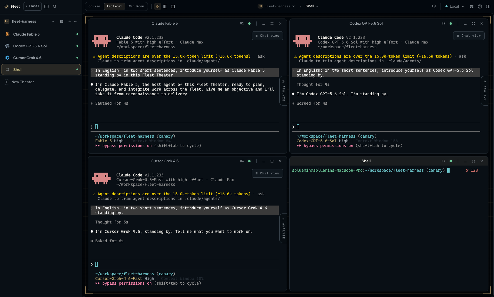
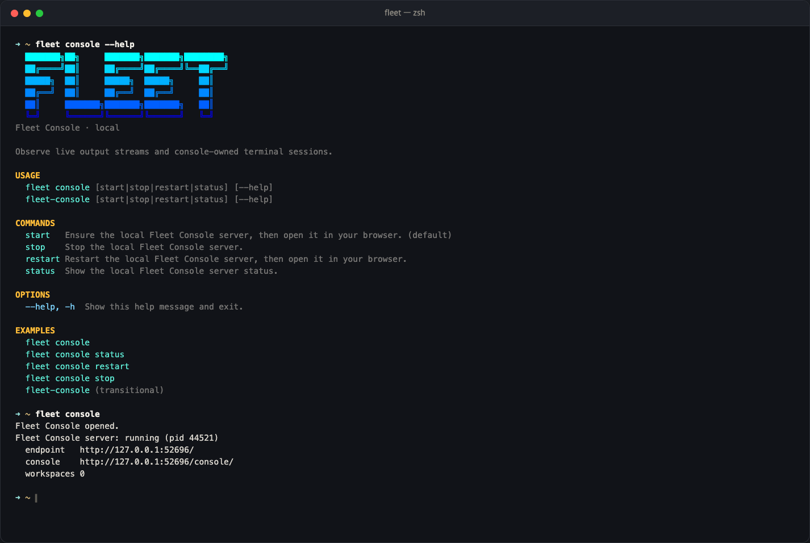
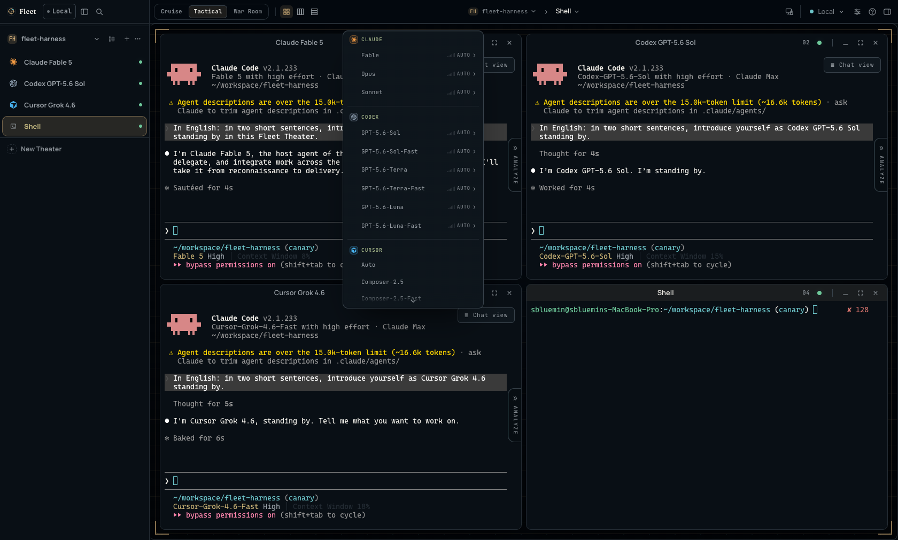
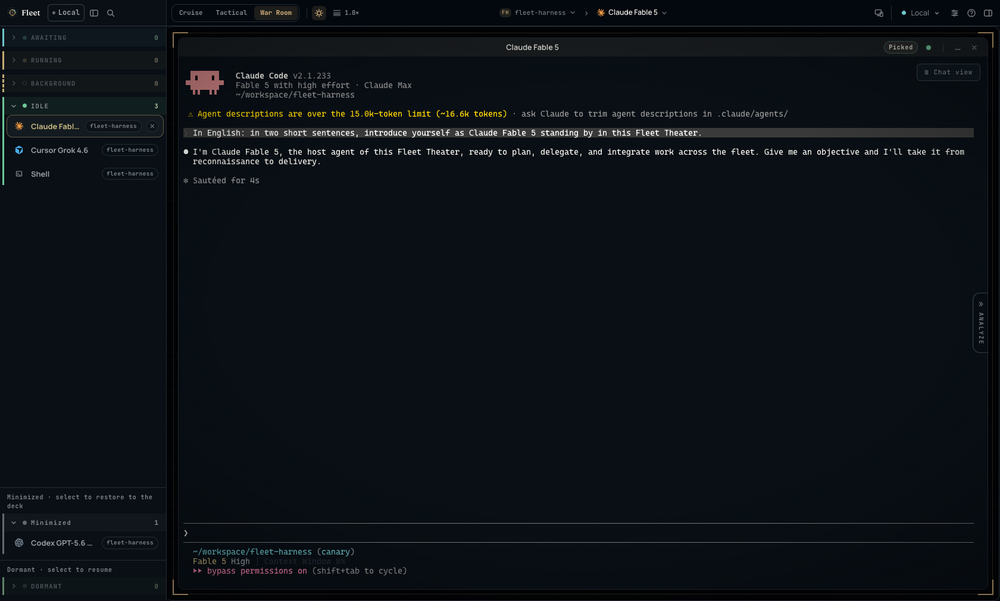
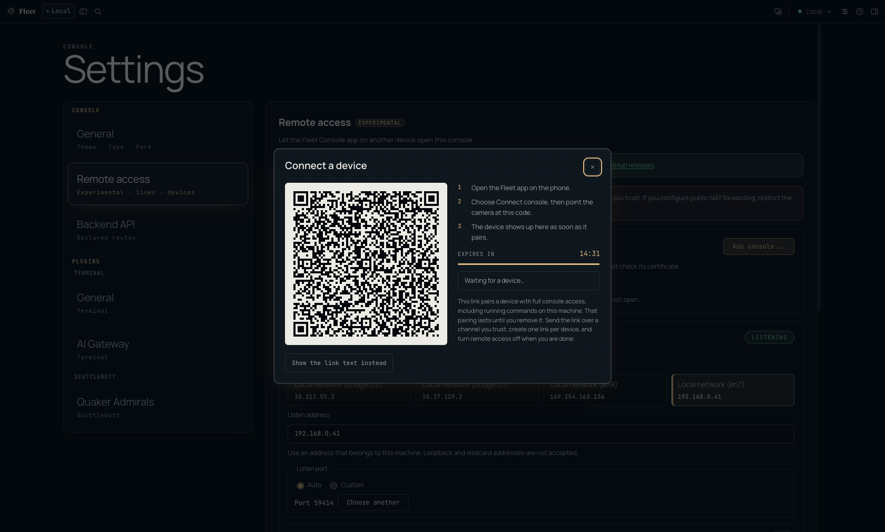
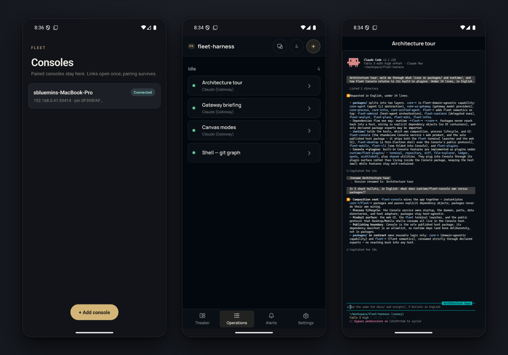

<p align="center">
  
</p>

<h1 align="center">Every frontier coding agent.<br/>One console. Any screen.</h1>

<p align="center">
  <strong>Fleet runs your coding agents as live, server-owned sessions on your machine</strong> —<br/>
  and lets you command them from a browser, a native desktop window, or the phone in your pocket.
</p>

<p align="center">
  <a href="https://www.npmjs.com/package/@dotobokuri/fleet-console"></a>
  <a href="./LICENSE"></a>
  <br/>
  <a href="README.md">English</a> · <a href="README.ko.md">한국어</a>
</p>



<p align="center"><sub>One Theater, four live Operations: Claude Fable 5, Codex GPT-5.6 Sol, and Cursor Grok 4.5 answering side by side, next to a plain shell. Every screenshot in this README is a real capture of Fleet running this repository.</sub></p>

Working with one AI coding agent is a workflow. Working with five is a mess of terminal tabs — until you give them a deck to land on. Fleet turns every agent session into an **Operation**: a real PTY owned by a local server, laid out on an infinite canvas, observable from any device you trust.

## Start in one command

Requires Node.js 20.19+ and at least one authenticated agent CLI on `PATH`.

```bash
npm install -g @dotobokuri/fleet-console

fleet console
```



Everything runs on your machine. The server binds to loopback by default, the browser never receives provider tokens, and remote access stays off until you deliberately turn it on.

## Agents that outlive the tab

An Operation is owned by the local Fleet Console server, not by your browser. Close the tab and the PTY keeps running, its output keeps buffering; reopen the console and the session replays its scrollback and carries on. Idle agents go dormant after a threshold you choose and come back with one click. Closing an Operation stays undoable for a few seconds, so a misclick costs nothing.

A **Theater** is a project folder. Register as many as you work in — every panel, session, and tool follows the active one.

## Every frontier model behind one launch menu



Right-click the canvas and launch Claude Code on any model you have enabled — its built-in Claude models, or gateway models that ride credentials the Console holds for you. The gateway is a local Claude Code endpoint, not an API proxy: the native agent loop, tool grammar, and authentication are preserved, and non-Anthropic credentials never enter the agent process.

| Provider | Credential | Models |
|---|---|---|
| **Codex** | ChatGPT subscription | GPT-5.6 Sol · Terra · Luna, each with a Fast variant |
| **Cursor** | Cursor subscription | Auto · Composer 2.5 · Grok 4.5 · Grok 4.6, with Fast variants · Opus 5 · Fable 5, each with a Max Mode 1M variant |
| **Moonshot-Kimi** | API key | Kimi K3 1M · K3 256K |
| **OpenCode Go** | API key | MiniMax M3 · Qwen3.8 Max · DeepSeek V4 Flash / Pro · GLM-5.2 · Kimi K3 · MiMo V2.5 / Pro · HY3 · Grok 4.5 · GPT-5.6 Luna |

Enable exactly the roster you want under **Settings → AI Gateway** — only those models appear in the launch menu and in Claude Code's `/model` picker. Models that support reasoning effort carry their own ladder — how far it climbs varies by model — and the deepest expose apex tiers behind a gate of their own: **MAX**, and **ULTRACODE**, which launches Claude Code with xhigh effort and standing multi-agent orchestration in one move. Usage-limit meters read the same risk verdict the gateway uses, so a window being spent faster than it refills shows as at-risk before a run stops.

## A canvas that scales from one agent to a fleet



Operations live on an infinite canvas, and a switch in the command band decides how much of the arranging you do yourself:

| Mode | What it does | Shortcut |
|---|---|---|
| **Cruise** | Place panels wherever you want them; Station Keeping keeps them from overlapping | — |
| **Tactical** | Lay every panel out at once, in grid, columns, or rows | <kbd>Alt</kbd>+<kbd>F</kbd> |
| **War Room** | Take waiting panels one at a time from a cross-Theater queue | <kbd>Alt</kbd>+<kbd>T</kbd> |

War Room is the one to reach for when several agents are waiting on you: it stages a single Operation, keeps the rest in an up-next rail, and lets you defer one without losing its place. <kbd>Alt</kbd>+<kbd>S</kbd> sorts the sidebar by status — working, waiting, idle — and every Operation wears the glyph and colour of the provider that launched it. <kbd>⌘</kbd>+<kbd>K</kbd> searches Operations across every Theater; <kbd>⌘</kbd>+<kbd>P</kbd> opens the command palette.

## The whole project, beside the terminal


The Activity Rail ships with eight built-in panels — **Alerts, Codex, Shell, Files, Repository, Skills, Ledger,** and **Usage limits** — and installed plugins can contribute their own. The Repository panel alone gives you history, working changes, compare, worktrees, branches, tags, and stashes for the active Theater without leaving the operation you are supervising. Ledger and Usage limits keep token spend and provider quota in the same rail, so you notice a window filling up before a run stops.

**Session Analyst** adds read-only intelligence to any single Operation: ask what happened, what deserves review, or for a handoff brief — it reads the session without disturbing the agent, publishes longer answers as rendered, evidence-cited artifacts, and runs on whichever CLI, model, and effort you give it.

## Your fleet, in your pocket



Turn on **Remote access**, and this console can be opened by devices you pair — and only by devices you pair. Show the QR code, scan it with the Fleet Android app (or paste the link), and the phone is in:



The same Operations you left on the desk — the middle phone lists them, the right one is a full Claude Code session, scrollback and all. The mobile app keeps its own doctrine of paranoia:

- **Pairing is the only door.** A remote listener answers nothing else without a session. Access links work once, expire in 15 minutes unused, and each pairs exactly one device — but the pairing itself survives restarts on both ends.
- **Certificates are pinned.** Every link carries the console's certificate fingerprint; a console that answers with a different certificate simply does not open. The Android shell verifies the pin natively before the WebView sees a single byte.
- **One controller at a time.** When another device takes control, everyone else drops to watching behind an explicit curtain — no two keyboards typing into one PTY. Monitoring-only links exist for screens that should watch and never type.
- **Public reach is opt-in twice.** LAN listening is one decision; advertising a public hostname over a NAT route is a separate, explicitly acknowledged one, with the router rule spelled out in the fields a router actually asks for and a failure budget on the pairing door so an exposed endpoint cannot be hammered for free.

The Android app lives in this repository under `runtime/fleet-mobile` (debug builds via its build script); Fleet Console Desktop — a thin native shell with tray lifecycle, managed runtime, and platform updates over the same verified origin — installs from the [latest GitHub Release](https://github.com/sbluemin/fleet-harness/releases/latest).

## Make it yours

Light or dark, then the dark tone that suits the room — **Instrument**, **Maritime**, or **Carbon**. UI and terminal typography are configurable independently, down to the fonts installed on your machine. The console speaks English and Korean across its chrome, settings, shortcuts, and built-in plugins, and switches immediately without a reload. Fleet Wiki keeps architecture decisions and product history in the same workspace as execution, so the reasoning behind a change outlives the transcript that produced it.

> Fleet Console is a research preview.

## Go deeper

- [Fleet Development Reference](docs/fleet-development-reference.md) — extend hosts and use the SDK
- [Admiral Workflow Reference](docs/admiral-workflow-reference.md) — orchestration architecture and doctrine
- [Desktop guide](runtime/fleet-desktop/README.md) — artifacts, update behavior, and current limits
- [Changelog](CHANGELOG.md) — release history

## License

MIT
