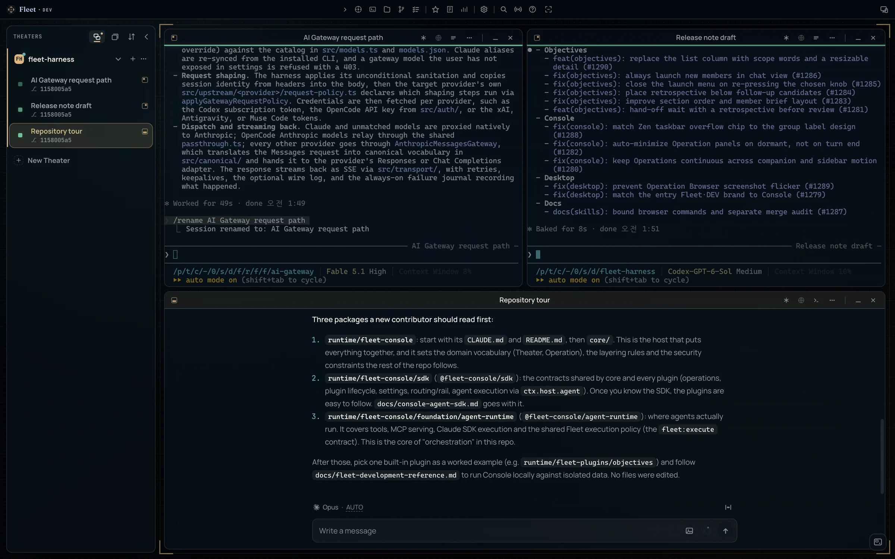
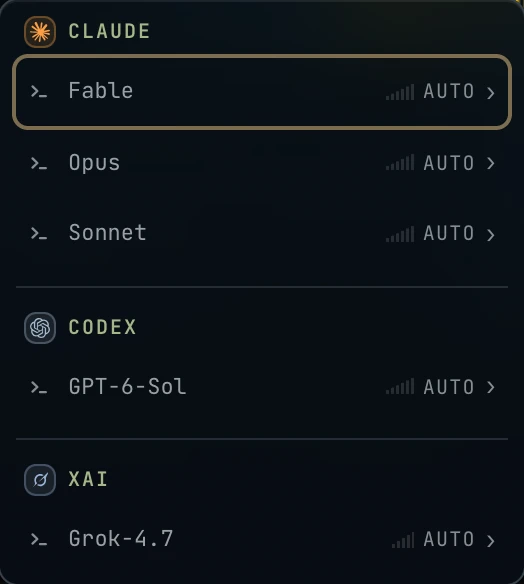
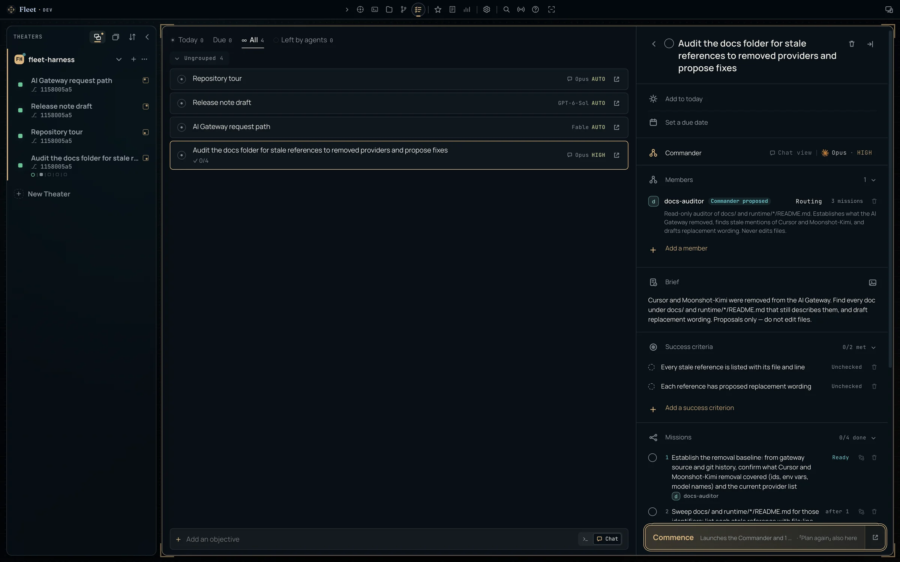
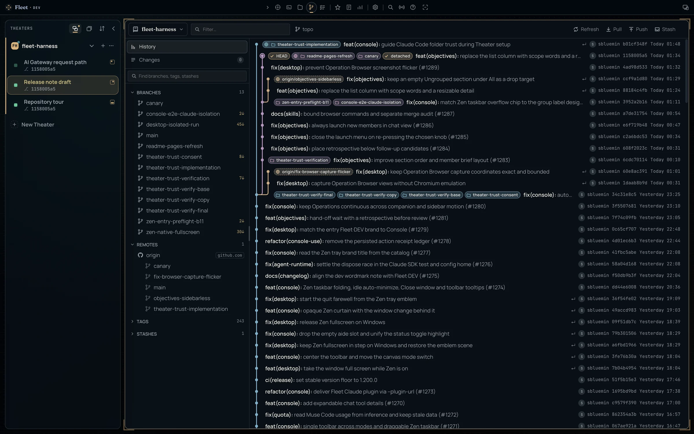
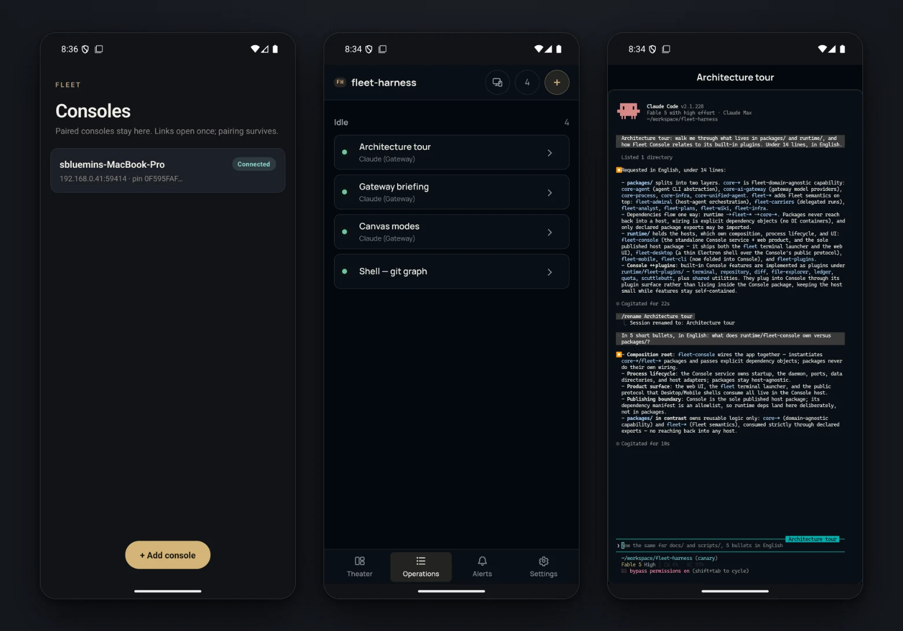

<p align="center">
  
</p>

<h1 align="center">Fleet</h1>

<p align="center">
  <b>A quiet console for a fleet of coding agents.</b><br/>
  Run Claude Code on every frontier model, keep each session alive on your own machine,<br/>
  and supervise the whole fleet from a browser, the desktop app, or your phone.
</p>

<p align="center">
  <a href="https://github.com/sbluemin/fleet-harness/releases/latest"></a>
  <a href="./LICENSE"></a>
  <a href="https://sbluemin.github.io/fleet-harness/"></a>
</p>

<p align="center">
  <b>English</b> · <a href="README.ko.md">한국어</a>
</p>

<br/>



<p align="center"><sub>One Theater, three Operations on three models. Fable traces the AI Gateway, GPT-6-Sol drafts a release note, and Opus gives a repository tour in chat view. The capture is from this repository.</sub></p>

<br/>

## Start

```bash
npm i -g https://github.com/sbluemin/fleet-harness/releases/latest/download/fleet-console.tgz
fleet console
```

`fleet console` starts a local server and prints its address. Open that address in any browser. You need Node.js 20.19 or later and Claude Code installed and signed in. Running `fleet` on its own opens Claude Code in your terminal, routed through the same AI Gateway.

Update from the Console or with `fleet update`. `npm update -g` rolls Fleet back to the old version left on npm.

Add a project folder as a **Theater**, then right-click the canvas to launch your first **Operation**.

## Sessions that outlive the tab

An Operation is a Claude Code session owned by the Fleet server, not by the page you're looking at. You can close the tab, reload, or switch devices, and the session keeps running. When you come back, its scrollback replays. Each Operation can be shown as a full terminal or as a chat view, and you can switch between the two mid-session. Idle sessions go dormant and wake with a click. A closed panel can be reopened with <kbd>⌘</kbd><kbd>Z</kbd>.

## Every frontier model, behind one launch menu



The launch menu lists Claude's own models first, then every gateway model you've enabled under **Settings → AI Gateway**. The same list appears in Claude Code's `/model` picker.

The gateway is a local Claude Code endpoint, not an API proxy. Claude Code keeps its native agent loop and tools. Other vendors' credentials stay inside the Console and never enter the agent process. Fleet reuses the sign-in you already have in each vendor's own CLI.

<br clear="right"/>

| Provider | Sign-in | Models |
|---|---|---|
| **Codex** | ChatGPT subscription | GPT-6.1 Sol, GPT-6 Astra · Sol · Luna, GPT-5.6 Terra, each at 272K, 524K or 1M context, with a Fast twin |
| **Antigravity** | Google subscription | Gemini 3.8 Flash · Gemini 3.1 Pro |
| **xAI** | Grok subscription | Grok 4.7 · Grok 4.7 Fast · Grok Composer 2.5 Fast |
| **Cursor** | Cursor subscription | Grok 4.7 · Grok 4.7 Fast, each at 256K or 500K context · Muse Spark 1.3 at 300K or 1M |
| **Muse Code** | Muse Code subscription | Muse Spark 1.3 · Muse Spark 1.3 Contributor |
| **OpenCode Go** | API key | GLM-5.3 · GLM-5.3 Flash · DeepSeek V4 Pro · V4.1 Flash · V4 Flash Vision |

Each model carries its own reasoning ladder. Every row also offers **ULTRACODE**, which launches Claude Code at xhigh effort with standing multi-agent orchestration. With **AI Gateway routing** turned on, subagents and workflow stages are assigned to gateway models, and providers whose usage window is nearly spent are skipped. The **Usage limits** meters use the same measure, so you see a window running hot before it stops a run.

## Hand off work that takes more than one turn



An **Objective** is work you hand off whole. You write what you want and how you'll know it's done, and a Commander session carries it through.

1. **Brief.** Describe the work and add success criteria.
2. **Plan.** The Commander lays out missions, their prerequisites, and any member sessions it needs. Nothing runs yet.
3. **Commence.** The Commander works the missions itself or passes them to members. Each member has its own role, model, and effort.
4. **Hand-off.** The objective comes back with a retrospective. You review it, complete it, and can turn follow-up candidates into new objectives.

Open Objectives from the toolbar or with <kbd>⌘</kbd><kbd>⇧</kbd><kbd>Y</kbd>.

## A canvas that arranges itself

Operations live on an infinite canvas. You choose how much of the arranging you do yourself.

| | What it does | Keys |
|---|---|---|
| **Cruise** | Place panels anywhere. Station Keeping keeps them from overlapping. | |
| **Align all** | Lays every panel out as a grid, columns, or rows. Toggle it off and each panel returns to where it was. | <kbd>Alt</kbd><kbd>F</kbd> |
| **Snap layouts** | Drag a panel to the top edge for halves, thirds, 2×2 and more. Snap Assist offers panels for the empty slots. | <kbd>⌘</kbd><kbd>Alt</kbd><kbd>←</kbd> <kbd>→</kbd> |
| **War Room** | Puts one waiting Operation on stage at a time, across every Theater. | <kbd>Alt</kbd><kbd>T</kbd> |

<kbd>⌘</kbd><kbd>K</kbd> jumps to any Operation, file, or wiki page. <kbd>⌘</kbd><kbd>P</kbd> opens the command palette, <kbd>⌘</kbd><kbd>J</kbd> opens Quick Launch, and <kbd>Alt</kbd><kbd>S</kbd> sorts the sidebar by status. Every shortcut can be rebound. On Windows and Linux, <kbd>⌘</kbd> is <kbd>Ctrl</kbd>.

## The project, beside the session



The toolbar opens tools that follow the active Theater:

- **Repository**: history, changes, compare, worktrees, branches, tags, and stashes.
- **Files**: a tree with quick peek, pinned folders, and git status tints.
- **Shell**: one terminal for the whole Console, a keystroke away (<kbd>Ctrl</kbd><kbd>`</kbd>).
- **Codex**: the project wiki. An experimental Cowork mode lets an AI draft edits to a page, and nothing changes until you apply them.
- **Skills**: browse and install skills.
- **Ledger** and **Usage limits**: token spend and provider quotas.
- **Objectives**: the work you've handed off.

Beside any single Operation you can also open these companions:

- **Session Analyst** (<kbd>Alt</kbd><kbd>A</kbd>) reads a session without disturbing it and answers what happened, what needs review, or how to hand it off.
- **Operation Browser** (<kbd>Alt</kbd><kbd>B</kbd>, Desktop only) is a browser the agent drives on the same tabs you see, and you can annotate a page for it.

With **Console Use**, agents can operate the Console itself. **Computer Use** extends that to Mac apps. Both are granted per Operation, and each request is approved inside the panel.

## On any screen

**Desktop.** Fleet Console Desktop is a thin native shell for macOS, Windows, and Linux, available from [GitHub Releases](https://github.com/sbluemin/fleet-harness/releases/latest). It manages its own Console runtime and updates itself on macOS and Windows.

**Remote access.** Remote access is experimental and off by default. Once you turn it on, a Console opens only to devices you pair:

- Access links work once and expire after 15 minutes.
- Every link is pinned to the Console's certificate.
- Only one device controls at a time; the others watch behind a clear curtain.
- Monitoring-only links let a screen watch without typing.
- Reaching the Console over the public internet is a separate opt-in.



**Mobile.** The same Operations you left on your desk are on your phone, with full scrollback. The Android and iOS apps are in tester distribution; the source lives in [`runtime/fleet-mobile`](runtime/fleet-mobile).

## Local by default

- The server binds to loopback. Nothing is reachable from other machines until you enable remote access.
- Provider credentials stay in the Console. The browser only receives one-use terminal tickets.
- Sessions, settings, and history live on your machine under `~/.fleet`.

## Make it yours

Choose a theme: **Instrument**, **Maritime**, or **Carbon** (dark), or **Whites** (light). You can add Liquid glass, pick interface and terminal fonts from those installed on your machine, and rebind every shortcut. The Console speaks English and Korean and switches between them without a reload.

## Go deeper

- [Fleet Development Reference](docs/fleet-development-reference.md): extend hosts, build plugins, and run an isolated development Console
- [Console Agent SDK](docs/console-agent-sdk.md): the contracts plugins build on
- [Admiral Workflow Reference](docs/admiral-workflow-reference.md): orchestration architecture and doctrine
- [Desktop guide](runtime/fleet-desktop/README.md): artifacts, updates, and current limits
- [Changelog](CHANGELOG.md): release history

## License

[MIT](LICENSE)
